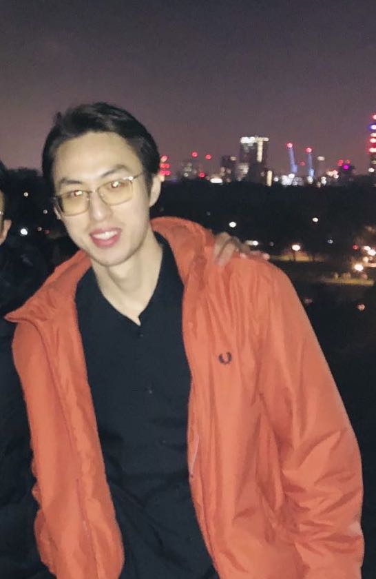
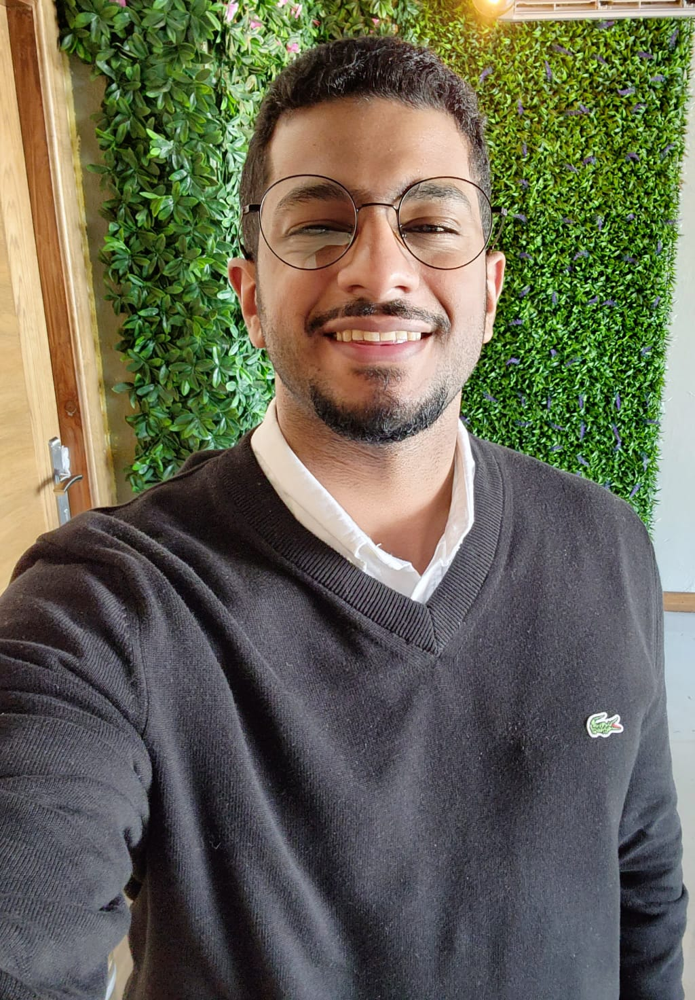
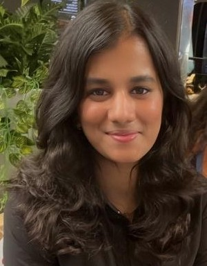

  

    
    <h4>Professor Matthew Todd</h4>
    
Principal Investigator

    

    

      <a href="https://www.linkedin.com/in/matthew-todd-81633313/"><i class="fa fa-linkedin"></i></a>
      <a href="https://twitter.com/MatToddChem"><i class="fa fa-twitter"></i></a>  
      <a href="https://intermolecular.wordpress.com/"><i class="fa fa-wordpress"></i></a>
      <a href="https://en.wikipedia.org/wiki/Matthew_Todd_(chemist)"><i class="fa fa-wikipedia-w"></i></a>
      <a href="https://github.com/mattodd"><i class="fa fa-github"></i></a>
      <a href="mailto:matthew.todd@ucl.ac.uk"><i class="fa fa-envelope"></i></a>
    

  

Mat Todd was born in Manchester, England. He was educated at Cambridge University where he obtained an MA in Natural Sciences in 1995 and a PhD in organic chemistry (with Chris Abell) in 1999. He was then a Wellcome Trust postdoc at The University of California, Berkeley (99-00), a College Fellow back at New Hall (now Murray Edwards) College, Cambridge University (00-01), a Lecturer in Chemistry at Queen Mary, University of London (01-05) and between 2005 and 2018 was at the School of Chemistry, The University of Sydney where he moved from Lecturer to Associate Professor. He is now Professor and Chair of Drug Discovery at University College London (2018-present).

His research interests include the development of new ways to make molecules, particularly how to make chiral molecules with new catalysts. He is also interested in making metal complexes that do unusual things when they meet biological molecules or metal ions. His lab motto is _To make the right molecule in the right place at the right time_, and his students are currently trying to work out what this means.

He has a significant interest in open science, and how it may be used to accelerate research, with particular emphasis on open source discovery of new medicines. He founded and currently leads several open science consortia such as [Open Source Malaria (OSM)](http://opensourcemalaria.org/) (see the group's research page) and is a founder of a broader [Open Source Pharma](http://www.opensourcepharma.net/) movement. In 2011 he was awarded a New South Wales Scientist of the Year award in the Emerging Research category for his work in open science and in 2012 the OSM consortium was awarded one of three Wellcome Trust/Google/PLoS Accelerating Science Awards. For his open source research, Mat was selected for the Medicine Maker's Power List in [2017](https://themedicinemaker.com/power-list/2017/) and 2018. He is on the Editorial Boards of PLoS One, ChemistryOpen and Nature Scientific Reports. He has been a sabbatical visitor at Stanford, UCSF, the Broad Institute and [Pembroke College, Oxford](https://www.pmb.ox.ac.uk/fellows-staff/profiles/dr-matthew-todd). He lives in Greenwich, London, with his wife and two children. He is related to [Trevor Horn](https://en.wikipedia.org/wiki/Trevor_Horn) and, apparently, [Samuel Crompton](https://en.wikipedia.org/wiki/Samuel_Crompton).

<h2>Postdoctoral Research Associates</h2>

  

    
    <h4>Dr Eve Carter</h4>
    
Postdoc (UCL)  2022-present

    

    

      <a href="https://www.linkedin.com/in/eve-carter-a59576153/"><i class="fa fa-linkedin"></i></a>
      <a href="https://github.com/EveCarter"><i class="fa fa-github"></i></a>
      <a href="mailto:eve.carter@ucl.ac.uk"><i class="fa fa-envelope"></i></a>  
    

    

  

    
    <h4>Dr Alvaro Magalhaes</h4>
    
Postdoc (UCL)  2023-present

    

    

      <a href="https://www.linkedin.com/in/alvaro-magalhaes/"><i class="fa fa-linkedin"></i></a>
      <a href="https://github.com/alvaro-magalhaes"><i class="fa fa-github"></i></a>
      <a href="mailto:a.magalhaes@ucl.ac.uk"><i class="fa fa-envelope"></i></a> 
      <a href="https://twitter.com/alvarofmagalha"><i class="fa fa-twitter"></i></a>
    

    

  

    
    <h4>Dr Rebecka Isaksson</h4>
    
Postdoc (UCL)  2023-present

    

    

      <a href="https://www.linkedin.com/in/rebecka-isaksson-74418618/?originalSubdomain=uk"><i class="fa fa-linkedin"></i></a>
      <a href="mailto:r.isaksson@ucl.ac.uk"><i class="fa fa-envelope"></i></a> 
      <a href="https://twitter.com/IsakssonRebecka"><i class="fa fa-twitter"></i></a>
    

    

  

  

    
    <h4>Dr Hadia Almahli</h4>
    
Postdoc (UCL)  2023-present

    

    

      <a href="https://www.linkedin.com/in/hadia-almahli-09588656/?originalSubdomain=uk"><i class="fa fa-linkedin"></i></a>
      <a href="mailto:h.almahli@ucl.ac.uk"><i class="fa fa-envelope"></i></a> 
      <a href="https://twitter.com/HAlmahli"><i class="fa fa-twitter"></i></a>
    

    

<h2>PhD Students</h2>

  

    
    <h4>Mathamsanqa Bhebhe</h4>
    
PhD Student (USyd)  2017-present

    

    

      <a href="https://www.linkedin.com/in/mathamsanqa-bhebhe-b53281101/"><i class="fa fa-linkedin"></i></a>
      <a href="https://twitter.com/MNBhebhe"><i class="fa fa-twitter"></i></a>
      <a href="https://github.com/mbhebhe"><i class="fa fa-github"></i></a>
    

    

  

    
    <h4>Dmitrij Melechov</h4>
    
PhD Student (UCL)  2019-present

    

    

      <a href="https://github.com/dmitrij176"><i class="fa fa-github"></i></a>
      <a href="mailto:dmitrij.melechov.17@ucl.ac.uk"><i class="fa fa-envelope"></i></a>
    

    

  

    
    <h4>Yuhang (Wiesel) Wang</h4>
    
PhD Student (UCL)  2019-present

    

    

      <a href="https://www.linkedin.com/in/wiesel-henson-0202/"><i class="fa fa-linkedin"></i></a>
      <a href="https://twitter.com/ericwan59398945"><i class="fa fa-twitter"></i></a>
      <a href="https://github.com/Yuhang-CADD"><i class="fa fa-github"></i></a>
      <a href="mailto:yuhang.wang.19@ucl.ac.uk"><i class="fa fa-envelope"></i></a>
    

    

  

  

    

       
      <h4>Thomas Knight</h4>
      
PhD Student (UCL)  2021-present

      

      

        <a href="https://www.linkedin.com/in/thomas-knight-340784151/"><i class="fa fa-linkedin"></i></a>  
        <a href="https://twitter.com/tommbk97"><i class="fa fa-twitter"></i></a>
        <a href="https://github.com/TomkUCL"><i class="fa fa-github"></i></a>
        <a href="mailto:thomas.knight.21@ucl.ac.uk"><i class="fa fa-envelope"></i></a>
      

    

  

  

    

       
      <h4>Yinuo Wang</h4>
      
PhD Student (UCL)  2022-present

      

      

        <a href="https://www.linkedin.com/in/yinuo-wang-849277171/"><i class="fa fa-linkedin"></i></a>
        <a href="https://github.com/yinuowang0812"><i class="fa fa-github"></i></a>
        <a href="mailto:yinuo.wang.20@ucl.ac.uk"><i class="fa fa-envelope"></i></a>
        <a href="https://twitter.com/yinuo_w"><i class="fa fa-twitter"></i></a>
      

    

  

   

    

       
      <h4>Kangping Liu</h4>
      
PhD Student (UCL)  2023-present

      

      

        <a href="https://github.com/KangpingL"><i class="fa fa-github"></i></a>
      

    

  

  

    
    <h4>Mohsen Alamoudi</h4>
    
PhD Student (UCL)  2023-present

    

    

      <a href="https://www.linkedin.com/in/mohsenalamoudi"><i class="fa fa-linkedin"></i></a>
      <a href="https://twitter.com/Mo777sen"><i class="fa fa-twitter"></i></a>
    

    

<h2>MRes Students</h2>

  

    

       
      <h4>Sanjana Thomas</h4>
      
MRes Student (UCL Chem)  2022-present

      

      

        <a href="https://www.linkedin.com/in/sanjana-thomas-580b0a19b"><i class="fa fa-linkedin"></i></a>
      

    

  

  

    

       
      <h4>Guanghao Xu (Andy)</h4>
      
MRes Student (UCL Chem)  2022-present

      

      

        <a href="https://www.linkedin.com/in/guanghao-xu-228083253"><i class="fa fa-linkedin"></i></a>
      

    

  

    

    

       
      <h4>Yiwei Wang</h4>
      
MRes Student (UCL Pharmacy)  2022-present

      

      

        <a href="https://www.linkedin.com/in/yiwei-wang-65aab6251"><i class="fa fa-linkedin"></i></a>
        <a href="https://github.com/yiwei905"><i class="fa fa-github"></i></a>
      

    

  

<h2>MPharm Students</h2>

  

    

       
      <h4>Ju Hyeong Kim (Andy)</h4>
      
MPharm Student (UCL)  2022-present

      

    

  

  

    

       
      <h4>Yewon Oh</h4>
      
MPharm Student (UCL)  2022-present

      

    

  

<h2>MSc Students</h2>

  

    

       
      <h4>Zhaohang Feng</h4>
      
MSc Student (UCL)  2023-present

      

    

  

