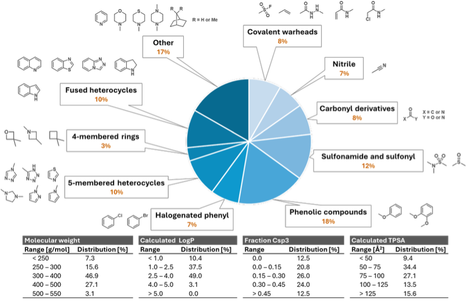
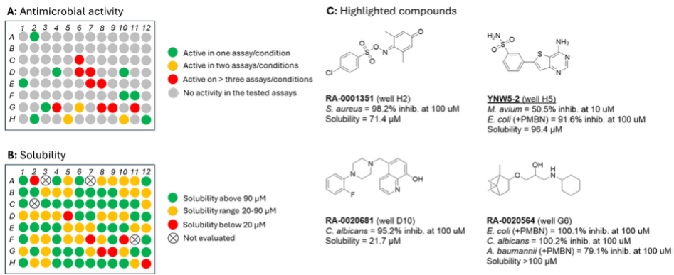

    <!-- Title -->
    

        <h1 class="text-4xl font-extrabold text-brand-dark mb-4">Idler compounds</h1>
    

    <!-- Intro Text -->
    

        

            We’ve created the <strong>Todd Idler Compound Library</strong> to catalogue, share and make best use of compounds synthesised in the Todd Group. The setup and sharing process is summarised in the graphic below and described in the manuscript <strong>“Idler Compounds: A Simple Protocol for Openly Sharing Fridge Contents for Cross-Screening”</strong> (DOI: <a href="https://chemrxiv.org/engage/chemrxiv/article-details/689f3121a94eede154e5ce6a" class="text-brand-primary hover:underline font-bold">10.26434/chemrxiv-2025-nqjb4</a>).
        

        

            As proof-of-concept, compounds have been shared with <strong>UKHSA</strong>, generating new data that now feeds into ongoing programmes and offers new starting points for projects. Results and underlying data are openly provided via the resources below.
        

    

    <!-- Resources Section -->
    

        <h2 class="text-2xl font-bold text-brand-dark mb-6 border-l-4 border-brand-primary pl-4">Get started (Resources)</h2>
        <ul class="list-disc pl-6 text-lg text-slate-600">
            <li>
                <strong>Live inventory (Google Sheet):</strong> 
                <a href="https://uk-mynotebook.labarchives.com/doc/view/MTkyNS4zfDIxNzcxLzE0ODEvRW50cnlQYXJ0LzE0Mzg2NjQ4NDN8NDg4Ny4z?nb_id=MjgzMDIuM3wyMTc3MS8yMTc3MS9Ob3RlYm9vay8zODQ5MTQwNjQ0fDcxODQ0LjM%3D" class="text-brand-primary hover:underline font-medium ml-1">Link to spreadsheet</a>
            </li>
            <li>
                <strong>LabArchives notebook (data):</strong> 
                <a href="https://uk-mynotebook.labarchives.com/share/Todd%2520Group%2520Compound%2520Library/MC4wfDIxNzcxLzAvVHJlZU5vZGUvMTcyMDU1ODA0NHwwLjA=" class="text-brand-primary hover:underline font-medium ml-1">View notebook</a>
            </li>
            <li>
                <strong>Zenodo collection:</strong> 
                <a href="https://zenodo.org/records/16793669" class="text-brand-primary hover:underline font-medium ml-1">https://zenodo.org/records/16793669</a>
            </li>
        </ul>
    

    <!-- How it works Section -->
    

        <h2 class="text-2xl font-bold text-brand-dark mb-6 border-l-4 border-brand-primary pl-4">How it works</h2>
        <ol class="list-decimal pl-6 text-lg text-slate-600 mb-8 space-y-2">
            <li><strong>Accumulate compounds</strong> (purchased & synthesised).</li>
            <li><strong>Build a shareable library</strong> (stock samples + online records).</li>
            <li><strong>Curate a diverse plate</strong> and share (e.g., with <strong>UKHSA</strong>).</li>
            <li><strong>Receive results</strong> → generate new data & starting points → feed back to projects.</li>
        </ol>
        
        <!-- Overview Image -->
        
    

    <!-- Library composition properties & Screening overview -->
    

        <h3 class="text-xl font-bold text-brand-dark mb-6">Library composition properties & Screening overview and highlighted compounds</h3>
        
        <!-- 
            Grid layout handles the two images side-by-side on desktop, 
            stacked on mobile. This replaces the rigid width="47%" 
        -->
        

            

                
            

            

                
            

        

    

    <!-- All Data Section -->
    

        <h2 class="text-2xl font-bold text-brand-dark mb-6 border-l-4 border-brand-primary pl-4">All Data (2025)</h2>
        

            <a href="https://github.com/user-attachments/files/21771479/All_Data_MHT_0001.xlsx" class="flex items-center text-brand-primary group-hover:text-brand-primary-dark font-bold transition text-lg no-underline">
                <svg class="w-6 h-6 mr-3" fill="none" stroke="currentColor" viewBox="0 0 24 24"><path stroke-linecap="round" stroke-linejoin="round" stroke-width="2" d="M4 16v1a3 3 0 003 3h10a3 3 0 003-3v-1m-4-4l-4 4m0 0l-4-4m4 4V4"></path></svg>
                All_Data_MHT_0001.xlsx
            </a>
        

    

    <!-- Collaborators Section -->
    

        <h2 class="text-2xl font-bold text-brand-dark mb-4 border-l-4 border-brand-primary pl-4">For collaborators</h2>
        

            Interested in using or contributing to the Idler library? Please get in touch with the Todd Group (<a href="mailto:matthew.todd@ucl.ac.uk" class="text-brand-primary hover:underline font-bold">matthew.todd@ucl.ac.uk</a>).
        

    

    <!-- Footer Note -->
    

        
Last updated: Aug 2025

    

