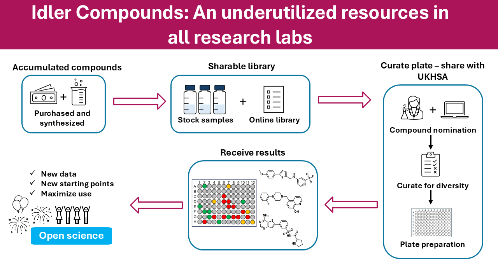

# Idler compounds
We’ve created the **Todd Idler Compound Library** to catalogue, share and make best use of compounds synthesised in the Todd Group. The setup and sharing process is summarised in the graphic below and described in the manuscript **“Idler Compounds: A Simple Protocol for Openly Sharing Fridge Contents for Cross-Screening”** (ChemRxiv DOI pending).

As proof-of-concept, compounds have been shared with **UKHSA**, generating new data that now feeds into ongoing programmes and offers new starting points for projects. Results and underlying data are openly provided via the resources below.

## Get started (Resources)

  <a class="btn btn-primary" href="https://docs.google.com/spreadsheets/d/1heWWU_xi_NSQRvNA5_wRuw_vI9lhMzXithmAKnpZMWW/edit?gid=0">Live Inventory</a>  
  <a class="btn" href="https://uk-mynotebook.labarchives.com/share/Todd%2520Group%2520Compound%2520Library/MC4wfDlxNzcxLzAvVHJIZU5vZGUvMTcyMDU1ODAOdHw=wL">View Overview LabArchives Notebook</a>    
  <a class="btn" href="https://uk-mynotebook.labarchives.com/share/Todd%2520Group%2520Compound%2520Library/MC4wfDlxNzcxLzAvVHJIZU5vZGUvMTcyMDU1ODAOdHw=wL" download>LabArchives notebook (data)</a>
  <a class="btn" href=https://zenodo.org/records/16793669](https://zenodo.org/records/16793669">Zenodo collection</a>

## How it works
1. **Accumulate compounds** (purchased & synthesised).
2. **Build a shareable library** (stock samples + online records).
3. **Curate a diverse plate** and share (e.g., with **UKHSA**).
4. **Receive results** → generate new data & starting points → feed back to projects.

## All Data (2025)

[All_Data_MHT_0001.xlsx](https://github.com/user-attachments/files/21771479/All_Data_MHT_0001.xlsx)

## For collaborators
Interested in using or contributing to the Idler library? Please get in touch with the Todd Group (matthew.todd@ucl.ac.uk).

---
Last updated: Aug 2025

---

