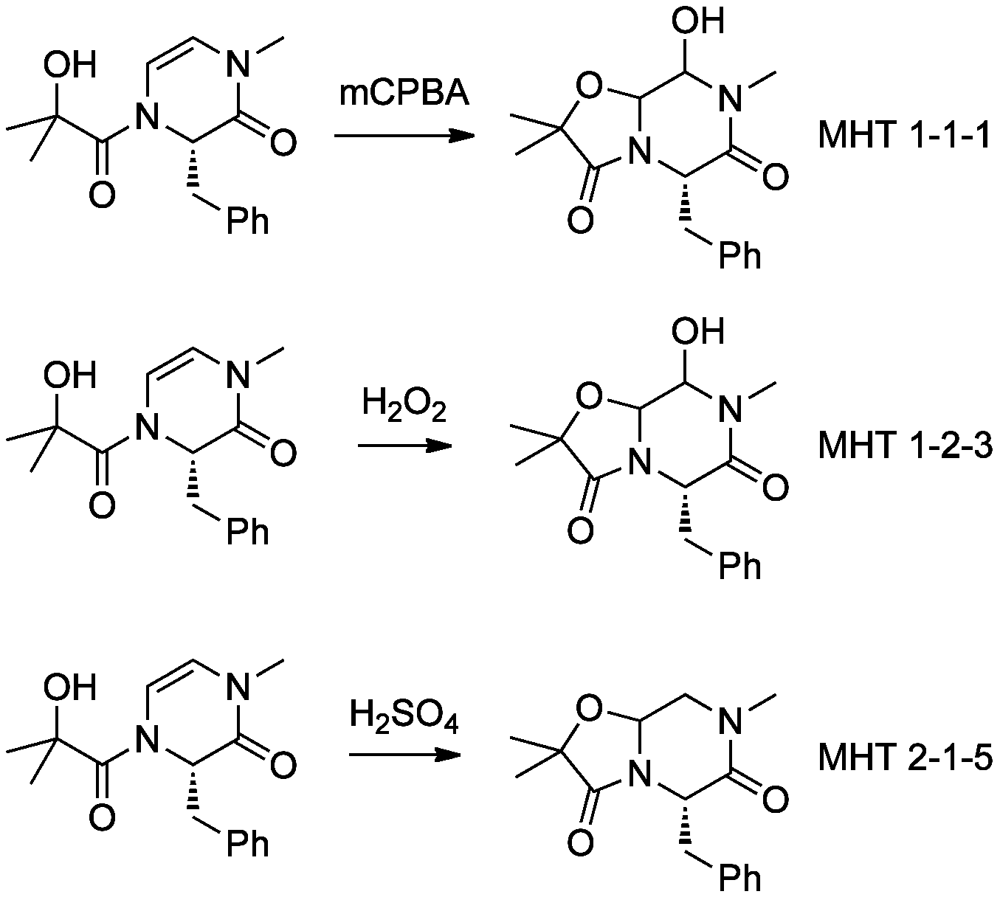

This page contains information for current members of the Todd group. Click a section to expand.

### Getting Started

  The following is a checklist of key things to do and documents for new members of the group:
  - Get a LabArchives account for experimental write-ups (invite from Mat Todd)
  - Get a Slack account for group communication (invite from Mat Todd)
  - Get a ChemInventory account for chemical inventory management (invite from postdoc)
  - Join the G25 MS Team (invite from Dana Klug)
  - Get authorisation to use myFinance to order chemicals/etc. (ask Mat Todd and John Day)
  - Organise and complete NMR training (see Emmanuel Samuel) -- click <a href="./docs/Onboarding/NMR Application Form.doc" download>here</a> to download the NMR application form (also fill out the section on Mass Spectrometry to submit samples for HRMS)
  - Organise and complete LCMS training (see senior group member/postdoc) -- see below for guides on LCMS usage
  - Organise and complete the lab safety induction (see Geoff Wells or Jamie Leitch)
  - Familiarise yourself with Risk Assessment forms for conducting reactions (on MS Teams)
  - Complete the Out of Hours form (get it signed by Mat Todd) -- click <a href="./docs/Onboarding/Out of Hours Form.docx" download>here</a> to download the Out of Hours form

### General Experimental Write-up Guidelines

<h3>Reaction Numbering</h3>
  

  Reactions need to be given a unique identifier. The number takes the following form: **YourInitialsX-Y** where **X** is the _reaction type_ and **Y** is the _attempt number_.

  **_Reaction Type_**

  A reaction type means ‘starting material-arrow-product.’ If you are attempting a certain transformation of a particular starting material to a particular product, then any attempt at that reaction has the same reaction number, _regardless of reagents/conditions_. The reaction has this number _regardless of the outcome_. It is the intention that counts. Stereochemistry of products is important – if the intended stereochemical outcome is different, the reaction has a different number. The numbering of reactions is unique to you, you do not use the same numbers as previous people in the group even if you are repeating their work.

  **_Attempt Number_**

  Attempt number just increases by 1 each time you do the reaction. Screening several different reaction conditions on small scale on the same page of your lab book can be named with ‘A’ ‘B’ ‘C’ after the full name if so desired, rather than exhaustively giving each reaction a different **Y**, so e.g. MHT 1-2-3A, MHT 1-2-3B etc.

  **_Example_**

  The first three reactions in MHT’s lab book are shown below. The first reaction here is the first in the lab book. This transformation is given the number ‘1.’ It is the first attempt at this reaction, so it is called ‘MHT1-1.’ (_ignore the third number - scheme needs fixing_) The second reaction is the same transformation (remember, regardless of reagents), so also has **X** = 1. It is the second attempt so has the identifier MHT1-2. The third reaction is a different transformation, so has a different **X**, and this is the first time it has been done, so **Y** = 1, giving MHT2-1.

  

  

  It is a very good idea to keep a tally where you list each transformation separately together with the identifiers of all the attempts along with the yields in each case. Remember the identifier stays the same even if the yield is 0%. If you keep your ELN ordered and tidy, you may be able to use it to provide this.

  For reactions that produce multiple products, and where those products are isolated e.g. by column chromatography, additional numbers may be needed, MHT1-1-1, MHT1-1-2 etc, and the relevant spectra and vials should be labelled as such.
  

<h3>ELN Write-Up</h3>
  

  _Transferring information from old website in progess_.

  Relevant page on the old website can be found [here](https://openwetware.org/wiki/Todd:Guidelines#Lab_Book_Write-up) in the meantime.
  

<h3>Sample Characterisation</h3>
  

  If you want to make a molecule, the first thing to do is check whether it’s been made before. Use SciFinder frequently (often you'll need to use it daily). You can access previously-used methods, characterisation data etc. It’s the most important resource we have. Besides being able to search for literature examples of reactions you may be attempting, it's also a very rapid way to find characterisation data for compounds you're making (from the "experimental properties" link).

  If you want to know how to handle a reagent, check e-EROS online.

  When you use a starting material for the first time, acquire a 1H NMR spectrum of it to check its purity and to compare with your reaction product.

  In general there are two kinds of characterisation required for molecules before we can publish the work:

  **_For Known Compounds_**

  These are compounds previously synthesised either in the group or by others in the chemical community. For these compounds we require three pieces of characterisation that match the literature (usually a 1H NMR, IR and low resolution mass spectrum). For crystalline solids we need a melting point and a comparison with the literature value, which can count as one of the three pieces of data. For enantiopure or scalemic compounds we require an optical rotation and a comparison with the literature value.

  **_For Novel Compounds_**

  For novel compounds, we require the full level of characterisation. This includes 1H and 13C NMR and IR spectra. We also need a low-resolution mass spectrum. For crystalline solids we require a melting point. If you have distilled a liquid, we require the boiling point. The ‘killer’ bit of characterisation that finishes off the data is either a high-resolution mass spectrum or (better) an elemental (CHN) analysis (not both). For enantiopure or scalemic compounds we require an optical rotation and some indication of the level of enantiopurity - this must come from chiral HPLC or NMR shift reagent analysis.

  For any compounds that undergo some form of further evaluation (e.g. biological evaluation) we need some assessment of purity, which is usually gained from comparison of melting points (for known compounds) or analytical HPLC analysis (for novel compounds).

  RF values are important for internal purposes, but have questionable reproducibility between labs. Thus while we need these values in lab books and internal reports, we do not generally report them in publications.

  Spectra should be kept in order of their unique identifier in folders. The identifier and structure should be written clearly so that someone browsing the file can locate the appropriate spectrum quickly. Think about the people who will come after you. Generally if you're asked to produce a spectrum, you should be able to find it in a few seconds.

  For NMR spectra, expand regions of interest - typically maybe 3-4 expansions for a 1H, one aromatic and one alkyl for a 13C. For writing up the data you will need the exact _J_ values for each well-defined peak, and an accurate _J_ needs ppm values for the relevant peaks to an accuracy greater than 2 decimal places. You must make sure the integrals for peaks have horizontal start and end lines, so that the values are real. Draw the structure of the molecule on the front page of the spectrum. Assign the peaks. If the spectrum shows a byproduct, draw this structure also. If the spectrum shows an unidentified product, draw the intended reaction and product on the front page, and indicate that the spectrum does not show this product. (It’s all about putting yourself in somebody else’s shoes and asking yourself whether your spectra would be clear to them – no mental notes)

  For publication purposes, we almost always require scanned copies of 1H and 13C NMR spectra for the supporting information. Thus you must examine and assign spectra very carefully to ensure that there are no ‘rogue’ peaks and no large solvent peaks. Obtaining clean NMR spectra and assigning them is the most important skill of the synthetic chemist. Once you've done all the above with your spectrum, you can show it to Mat.
  

<h3>Experimental Write-Up (for papers/reports/theses/etc.)</h3>
  

  _Transferring information from old website in progess_.

  Relevant page on the old website can be found [here](https://openwetware.org/wiki/Todd:Guidelines#Report_Write-up) in the meantime.
  

### General Writing Advice

<h3>Writing Accurately vs Writing Well</h3>
  

When you join a lab, you will have been through a lot of education. You may feel that you can write. Most lab scientists are quickly disabused of this idea. Writing science is hard. You will find that your writing goes through a very large number of edits. Don't freak out. Don't lose confidence. We're always students of writing.
    When you write something, the first thing to ensure is that it's error free. You can't be making little tiny errors that will distract your reader, like speling mistakes or annoying   spaces where there shouldn't be any or repetition of words where words are not needed because words have appeared where edits should have been made. Generally speaking, don't submit anything for anyone to read (particularly Mat) if there are any simple errors in the document (i.e. things that Word can find and highlight). You may ask yourself "why do little tiny errors matter? Surely it's the substance of the writing, not the little things?" No. Errors are distracting and their presence suggests to the reader that the work has not been well thought through. It will appear cobbled together. The reader starts to doubt the quality of what they are reading.
    The second thing to do when you're writing something is to make sure that the content is meaningful and correct. Sentences should appear in a logical order. Paragraphs should have a coherent theme, with new paragraphs being used for new thoughts. References should be used correctly (see elsewhere for more on this). Statements should be made that can be backed up with data. Words should be used precisely.
    The third thing to do is to make sure it's interesting. There is no law that says that science should be dull to read. To convey the excitement of what you are doing you should make it interesting to read. To achieve this requires a lot of practice, training and editing. It is an aim for a PhD student to construct an interesting thesis.

  

<h3>Consider Your Audience</h3>
  

When you write, think about who is going to read it. How you write changes depending on your audience. For most student reports and theses your audience is someone of your level of education (e.g. another undergrad, or grad student) who is trained in your broad scientific discipline (chemistry) but who is totally unfamiliar with your project. We can call this a "same-level stranger."
    Once you have a clear idea of your reader, you will be able to pitch the complexity and jargon suitably. There's no need to explain what a molecule is to a same-level stranger. But you might need to explain what a Minisci reaction is, or an alanine scan or a gametocyte.
    Don't try to be too clever. Don't feel the need to include complicated terms in order to sound impressive. If your same-level stranger would not understand it, explain it. There is nothing more likely to switch your reader off than feeling confused by jargon.
    There may be times you need to alter your writing because you're doing something for a different audience. When writing grant proposals, you can often assume a higher level of knowledge by your audience (at least for the technical bits). When writing for a general audience (e.g. a general science magazine) you may need to simplify things further.

  

### General Lab Guidance

<h3>Working Safely</h3>
  

  Everyone in the group (PDRAs and PhD students) will have certain responsibilities to maintain the lab to ensure that we all work as efficiently and safely as possible. A list of lab jobs can be found [here](https://github.com/todd-lers/techops/tree/master/Lab%20Rules) along with some general lab rules and guidance on the use of communal equipment.

  **The lab jobs will be reviewed periodically and updated.** _Any issues, contact Dana._

  [Current waste rota](https://github.com/todd-lers/techops/blob/master/rotas/Waste%20%26%20solvent%20rota%20-%20Jan-Mar%202020.pdf)

  [Current consumables rota](https://github.com/todd-lers/techops/blob/master/rotas/Consumables%20rota%20-%20Jan%20-%20Feb%202020.pdf)

## Housekeeping
  It is imperative that communal areas and the apparatus stored within them are left clean for the next person to avoid contamination and risk of injury.

  **Glassware** is limited so promptly clear up after yourself, particularly with more specialist equipment such as columns and don’t hoard items you’re not using on a daily basis.

  **Cleaning** – Glassware should be cleaned thoroughly on BOTH the inside and outside. First, rinse with detergent/water and then with acetone. You may need to do this multiple times to remove stubborn stains. If it is not possible to get an item clean, it must be subjected to harsher cleaning agents (e.g. acid/base bath) or suitably disposed of. Rinse with acetone before drying.

  **Solvent Winchesters** must be returned to the solvent cabinets when they are not in use (particularly overnight). We have a safety obligation to do this, and in addition, it makes it easier for others to locate solvents they need. Please don’t open several bottles of the same solvent and keep the flammables cabinet tidy. This allows us to quickly check stock levels.

  **Good gloving practice** – Gloves when used properly can help protect your skin from contamination from chemicals and other hazards. It's essential that you wash your hands once gloves have been removed. Disposable gloves must be discarded once removed and not saved for future use. Remove gloves before touching personal items, such as phones, computers and one’s skin. If for any reason a glove fails, and chemicals come into contact with skin, consider it an exposure and seek medical attention.

  **Balances** – The balances are a glove-free area to prevent cross contamination. If you’re weighing out something particularly toxic, use clean gloves and dispose of them after use. The balance spirit level should be checked before every use and the balance adjusted accordingly. If you are unsure how to do this, ask someone to show you. The balance should always be spotless. **Any spills should be dealt with immediately, to prevent permanent damage, using either ethanol or IPA.**

  **Rotavaps** – Ensure that the dry ice/IPA is topped up in the trap before applying vacuum. Do not use the ‘continuous’ function or apply full vacuum with solvent remaining in the collection flask as this will pull solvent through the pumps. Additionally, empty the collection flask to remove low boiling solvents, before attempting to remove higher boiling ones. Clean the adaptors and empty the collection flask after use, ready for the next user and set the bath temperature back down to 25 ºC. If you are removing higher boiling solvents such as water and DMF, clean the rotavap thoroughly to prevent contamination for the next user. Do not use the rotavaps on the benches to remove anything potentially toxic or smelly. The rotavap in the fumehood can be used for this purpose. Fill in the log book and clean the rotavap thoroughly after use.

  **Cutting TLC plates**– Cut whole plates using the guillotine and do not leave odd shapes. When finished, wipe down the area and **DO NOT leave loose silica lying around.**  

  **TLC station** – Keep the TLC dips area tidy. Either dip TLC plates directly into the stain bottles or use the pipettes provided. Don’t leave dirty/broken glass pipettes lying around and clear up after yourself. If you get stains on the bench, give it a wipe.

  **Hi-Vac line** – The vacuum should only be used to remove trace amounts of solvents. Excess solvent should be first removed on the rotavap. The trap gets blocked very easily if too much solvent is pulled in. Ensure that you top up the Dewar with liquid nitrogen when using the line. Some solvents take longer to remove than others, but don’t leave compounds on there for longer than required as space is limited. After switching off the line, ensure that you check the trap for any condensed solvent. This needs to be removed to ensure that the best possible vacuum is maintained.

  **Floor/bench space** – The floor space should be kept completely clear. Everything (including solvent Winchesters when in use) should be placed on the bench and not stored on the floor or on stools.

  **Sharps** – Needles must never be left around unprotected. Do not resheath needles. Dispose of them directly or store in a small vial for reuse if necessary.

## Waste Disposal

  In general, small amounts of waste (acetone washings, used silica, sharps etc.) can be contained and stored in individual fumehoods and then transferred to the dedicated storage area. However, for particularly hazardous waste, you may need to quench these if appropriate and move them to the final storage area and arrange for their disposal.

  * **Solvent waste**– Waste should be separated into chlorinated or hydrocarbon (non-chlorinated) and transferred to 10 L plastic drums which are stored in the waste fumehood. Drums can be collected from stores, and it is our responsibility to clearly label these with the type of waste (non-chlorinated or chlorinated) and the lab number (i.e. G25). Once full, these will need to be taken outside to the storage facility, ready for collection. **DO NOT TOTALLY FILL** waste containers as the contents can potentially expand when warmed. This presents a danger to us and those collecting the waste. **It is not one individual’s responsibility to collect waste drums from stores. Take initiative and collect more if needed.**

  * **Bins** – Gloves and other waste should be placed in **yellow tiger stripe** hazardous waste bags. Once full, these should be tied off with cable ties that can found in the consumables draw. Yellow bags will be taken outside for disposal by the cleaners if left by the door in the evening with a **Safe to Clean** card placed on the door. Waste paper towels generated from handwashing can be disposed off in the small bin (clear bag) near the handwash sink. No laboratory waste should be placed in this bin.

  * **Aqueous waste** – In general, aqueous acidic and basic waste should be neutralised and transferred to the appropriate 10 L waste drum in the waste fumehood.  

  * **Hazardous waste** – Filled containers of silica waste need to be appropriately labelled and disposal arranged. This is done through stores and is the responsibility of the person allocated to hazardous waste disposal. Very toxic waste and heavy metals (e.g. Pd, Cu, Ni) need to be transferred to clearly marked containers and their disposal arranged via stores. For commonly used heavy metals (i.e. Pd), waste containers can be stored in the waste fumehood rather than individual areas.

  * **Glass bins**– Glass waste is put into one of the designated bins. Once full these need to be closed, sealed with tape and taken outside.

## Lab Shut-Down

  At the end of the day, everyone needs to ensure that their area is shut down before leaving. The last person to leave should double check that the UV lamps, Biotage, rotavaps, pumps and hi-vacs are turned off. Fume hood sashes should be closed when leaving the lab - at any time of day.
  

<h3>Ordering from Stores and MyFinance</h3>
  

  The SoP stores stock list (sheet 1) and the MyFinance codes for MHT consumables, chemicals and solvents can be found (sheet 2) [here](https://docs.google.com/spreadsheets/d/1tHAEN-7AiHbOAox7VEqo7jfNPbfShzumsx0Yuazv9GM/edit?usp=sharing).

  The MHT consumables and chemicals are **everyone's responsibility**. If something is about to run out please order some more from stores or from MyFinance.

  If we get a new SoP stores stock list please update the one we have.

  The MyFinance codes for the consumables, chemicals and solvents are on sheet 2. These codes can be updated if you find a better or cheaper product.
  

<h3>Chemical Inventory (Reagent Management)</h3>
  

  It is essential to manage reagents correctly to not adversely affect your chemistry or that of others.

  All new compounds should be added onto **ChemInventory** immediately and assigned a suitable sub-location. **If you don't have access to ChemInventory please contact _Ed_ or _Jamie_.** All empty reagent bottles should be removed from the inventory before disposal. Empty bottles, or reagents that have been deemed unusable should be labelled as such, removed from the database and disposed of. – **This is the responsibility of everyone in the lab**.

  As a lab we will carry out an annual stock take (likely in December) to ensure that the inventory is up to date. It’s the responsibility of those assigned to managing the inventory to coordinate this and advise group members on appropriate locations for chemicals. _This needs to be in line with what’s expected by UCL and the UK in general._

  General guidelines for using the inventory system can be found [here](https://github.com/todd-lers/techops/blob/master/Inventory/G25%20Inventory%20guidelines.docx).
  

### How-To's and Manuals

<h3>Using the LCMS</h3>
  

## Using the Analytical LCMS

  A general guide on using the Analytical LCMS in G25 can be found [here](https://github.com/todd-lers/techops/blob/master/LCMS/LCMS-Analytical-Guide.pdf). The guide was prepared by Edwin G. Tse and Paul T. A. King and can be updated by anyone in the group. It serves as a walk through for how to properly use the Analytical LCMS. _This is not a substitute for proper training_.

  A quick introductory slideshow covering proper sample preparation and common courtesy rules can be found [here](https://github.com/todd-lers/techops/blob/master/LCMS/G25%20LCMS.pptx).

## Using the Preparative LCMS

  The operation of the preparative LCMS is identical to the analytical LCMS, with the addition of a fraction collector. A general guide on using the preparative instrument can be found [here](https://github.com/todd-lers/techops/blob/master/LCMS/Preparative%20LCMS%20Instructions.docx) and was prepared by Edwin G. Tse. _This is not a substitute for proper training_.

## LCMS Shutdown and Reboot

  The LCMS should only be shut down in the case of extended time away from lab. When rebooting, it is imporant that things are done in the proper order. A quick guide to rebooting can be found [here](https://github.com/todd-lers/techops/blob/master/LCMS/LCMS%20reboot.pdf).

## General Troubleshooting

  A list of common issues encountered while using the analytical and preparative LCMS instruments can be found [here](https://github.com/todd-lers/techops/blob/master/LCMS/LCMS%20Troubleshooting.docx). Where the fix is known, the solution is provided. If new issues are encountered while operating the LCMS instruments, it and its solution can be added to this list as a point of reference for the future.
  

<h3>Using the Biotage</h3>
  

## Biotage Selekt

  Biotage user manual can be found [here](https://github.com/todd-lers/techops/blob/master/Biotage/416183-C%20Selekt%20User%20Manual.pdf).

  Information on Biotage columns can be found [here](https://github.com/todd-lers/techops/blob/master/Biotage/pps497_-_biotage_sfr_brochure.pdf).

  Write down your name and type of purification (i.e. normal or reversed phase) on the table affixed to the fumehood sash. Only write down your name if you are ready to run your purification, otherwise wait until you are closer to being ready.

  **There is no booking system** and you can use the purification system as required, when it is not in use. There are currently 12 racks available.

  **Please don’t keep racks and tubes in your fumehood for prolonged periods of time.** Combine your fractions as soon as possible after doing a column and clean the tubes thoroughly, finishing with **several acetone rinses**. Alternatively, transfer your tubes to a normal test tube rack (return later) and return the empty Biotage rack. **Make sure there is no permanent marker on the tubes or on the rack.** To ensure that the tubes dry quickly for the next user, place them upside down onto tissue on the bench or place them in the large drying cabinet at the back of the lab, before returning them to the Biotage or the designated cupboard.

  We have bought many **Sfär cartridges** of varying sizes. You can reuse these several times by simply flushing with MeOH at the end of a run (to remove any impurities remaining on the column), followed by a less polar solvent. The column should then be dried by doing an air flush. As the Sfär columns contain spherical silica with a high surface area, they have a higher loading capacity. This means that you can use a smaller column than you usually would to achieve the same separation. Be aware that your compounds may behave differently on spherical silica in comparison to the standard Merck silica TLC plates we use. _You may need to alter your gradient accordingly._

  There are many methods of **loading** (i.e. liquid and dry) and you would have been sent a guide on this (_speak to Fahima if you haven't_). Once the silica has reached its lifetime (i.e. you start to see gaps between the silica and the frit) you can remove the frit and dispose of the silica. The empty cartridge can then be refilled as required.

  **If you need training on the instrument - contact the person in charge.**
  

### Rotas

Solvents

### Group Meetings

Current Schedule

### Grant Codes and Admin

Click <a href="./docs/Onboarding/Contacts List.docx" download>here</a> to download the contacts list containing who to contact when:
- encountering issues with instruments that you are unable to fix (i.e. Biotage and LCMS)
- looking for quotes on lab equipment, etc.
- you need help with NMR or mass spectrometry instruments in SoP
- you need to replace the argon cylinder in the lab
- you need to have hazardous chemical waste (including silica) removed
- you need a 19F NMR spectra for a sample

<h3>Project Codes</h3>
  

- Core: Project 549163, Award 156780 <-- don't use this from now on for consumables.  
- Discretionary: Project 549163, Award 156782.  
- Dmitrij: Project 552026, Award 156780, Task 100.  
- Yuhang: Project 564082, Award 177365, Task 100.
- Tom: Project: 566966, Award 180330
- Daniel: Project 570934, Award 184398, Task 100
- Antibiotics UK: Project 568406, Award 183633
- EPSRC/IAA/KEIF Generative (Ed): Project 571160, Award 174591
- Yinuo: Project 571228, Award 177365, Task 100
- Gates/SGC Contraceptives grant: Project 572553, Award 184940
- Chemistry MRes Student Spending: Project 574868, Award 177365
- READDI-AViDD: Project 575169 (SoP) or 575170 (LMCB), Award 185702

### Chemistry Resources

<h3>Useful Web Resources</h3>
  

  Fun site for exploring chemistry mechanisms via animations: [Chemtube3d](https://www.chemtube3d.com/)

  A useful online resource for general guidance on laboratory techniques [Not Voodoo](http://chem.chem.rochester.edu/~nvd/)

  An illustrative guide to using a Schlenk Line by Dr. Andryj Borys [Schlenk Line Survival Guide](https://schlenklinesurvivalguide.com/)

  [Organic chemistry lecture notes](http://www.oxfordsynthesiscdt.ox.ac.uk/programme/taught-course/modules.html) developed for the SBM CDT by academics from Oxford Chemistry and their industrial partners which are free to download.

  [Reaxys](https://www.reaxys.com/#/search/quick)

  [ChemSpider](http://www.chemspider.com/)

  [Web of Science](https://wok.mimas.ac.uk/)

  [IUPAC Gold Book](http://goldbook.iupac.org/)

  [Named Reagents](https://www.chem.wisc.edu/areas/reich/handouts/NameReagents/namedreag-cont.htm)

  [Lab Tips and Tricks by ChemistryViews](https://www.chemistryviews.org/subject/organic/searchResults.html?term=tips+and+tricks)

  [Organic Chemistry Portal - Named Reactions](https://www.organic-chemistry.org/namedreactions/)

  [Preparation of Cooling Baths](https://chem.libretexts.org/Ancillary_Materials/Demos%2C_Techniques%2C_and_Experiments/General_Lab_Techniques/Cooling_baths)

  [Evans' pKa Table](http://evans.rc.fas.harvard.edu/pdf/evans_pKa_table.pdf)

  [Common NMR Solvent Impurities](https://pubs.acs.org/doi/pdf/10.1021/om100106e)

  [Spectral Database for Organic Compounds SDBS](https://sdbs.db.aist.go.jp/sdbs/cgi-bin/direct_frame_top.cgi)

  [TLC Stain Recipes](https://www.chemistry.mcmaster.ca/adronov/resources/Stains_for_Developing_TLC_Plates.pdf)

  [Fun old TV episode (Cutting Edge) on the synthesis of natural products](https://www.youtube.com/watch?v=QhzxlcVjJis)

  [Connected Papers](https://www.connectedpapers.com/) - Very useful for doing lit searches.                                     
                                         
  

