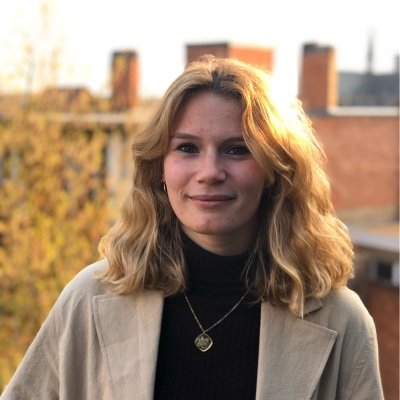
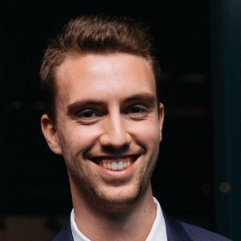

# Todd Group Alumni

(Hello lovely alumni - feel free to update your entries below. e.g. with what you're doing, or recent pictures.)

## University College London

|Name|Position|    Year    |Now|
|:------:|:------:|:------:|:------:|
|**Kato Leonard**   [LinkedIn](https://www.linkedin.com/in/kato-leonard-075982209/) [Twitter](https://twitter.com/katoleonard)|Erasmus|2022|
|**Jemima Haque** [LinkedIn](https://www.linkedin.com/in/jemima-haque-34a1911b2/)||2021|
|**Reuben McKay**   [LinkedIn](https://www.linkedin.com/in/reubenmckay/)|MRes|2020|
|**Giada Sabatino**   [LinkedIn](https://www.linkedin.com/in/giada-sabatino-77591b19b/)|MRes|2020|PhD, Hochschule für Life Sciences FHNW|
|**Fahima Idiris**   [LinkedIn](https://www.linkedin.com/in/fahima-idiris/)|Postdoctoral Fellow|2019-2020|Associate Principal Chemist, Pharmaron|
|**Dana Klug**   [LinkedIn](https://uk.linkedin.com/in/dana-klug-9829259a)|Postdoctoral Fellow|2019-2022|Medicinal Chemistry Project Leader, Arvinas|
|**Robert Hanson**  [LinkedIn](https://www.linkedin.com/in/robert-hanson-77073611/)|Sabbatical Visitor|2020|Professor, Northeastern University|
|**Gareth (Bryn) Parry**  [LinkedIn](https://www.linkedin.com/in/gareth-bryn-parry-358204194/)|MSc|2019|
|**Luxsika Rajendra**  [LinkedIn](https://www.linkedin.com/in/luxsika-rajendra-7b6858151/)|MSc|2019|Clinical Trial Assistant, Medpace|
|**Manisha Virdi**  [LinkedIn](https://www.linkedin.com/in/manisha-virdi-44251a147/)|MSc|2019|Strategic Solutions Associate, GLG|

## University of Sydney

|Name|Position|    Year    |Now|
|:------:|:------:|:------:|:------:|
|**Jamie Batten**   [LinkedIn](https://www.linkedin.com/in/jamie-michael-batten/)|PhD|2017-2021|Lead Chemistry Teacher, Matrix Education|
|**Marat Korsik**   [LinkedIn](https://www.linkedin.com/in/marat-korsik-590b64a1/)|PhD|2017-2021|Organics Analyst, National Measurement Institute Australia|
|**Paul King**   [LinkedIn](https://www.linkedin.com/in/paul-king-00547874/)|PhD|2017-2020|Chemist, Epichem|
|**Julius Adamson**|Honours|2018|PhD, The University of Sydney|
|**Nicholas Smith**|Honours|2018|PhD, The University of Sydney|
|**David Smith**  [LinkedIn](https://www.linkedin.com/in/david-smith-8366325a/)|Postdoctoral Fellow|2017–18|Lecturer, Federation University Australia|
|**Conor Graham**  [LinkedIn](https://www.linkedin.com/in/conor-graham/)|Honours|2017|Business and Technology Integration Associate, Accenture|
|**Malcolm Spain**  [LinkedIn](https://www.linkedin.com/in/malcolm-spain-79121817/)|Postdoctoral Fellow|2015–17|Senior Scientist I, Sosei Heptares|
|**Sebastien Dath**|Honours|2017||
|**Hung Phat Duong**  [LinkedIn](https://www.linkedin.com/in/hung-phat-duong-98a4b918b/)|Honours|2017|PhD, The University of Sydney|
|**Ryan Macdonald**|Visiting Student  (University of Southampton)|2017||
|**Christopher Brown**  [LinkedIn](https://www.linkedin.com/in/christopher-brown-9a8291145/)|Honours|2016|Medical Writer, McCann Health Australia|
|**Frank Jiang**|Honours|2016||
|**Alice Motion** (née Williamson)  [Personal Website](http://alicemotion.com/), [Wikipedia](https://en.wikipedia.org/wiki/Alice_Motion)|Postdoctoral Fellow|2012-16|[Associate Professor, University of Sydney](https://www.sydney.edu.au/science/about/our-people/academic-staff/alice-motion.html)|
|**Haochuan Mao**  [LinkedIn](https://www.linkedin.com/in/haochuan-mao-a14031173/)|Visiting Student  (Nanjing University)|2016|PhD, Wasielewski Group, Northwestern University|
|**Hasini Murage**  [LinkedIn](https://www.linkedin.com/in/hasini-murage-3a1533b4/)|Honours|2015|User Researcher, Australian Government Department of Human Services|
|**Daniel Moawad**  [LinkedIn](https://www.linkedin.com/in/daniel-moawad-9b996b13b/)|Honours|2015|Forensic Chemist, NSW Health Pathology|
|**Tianyi Zheng**  [LinkedIn](https://www.linkedin.com/in/tianyi-zheng-944524122/)|Visiting Student  (Nanjing University)|2016|PhD, University of Washington|
|**Sandra Ast**  [LinkedIn](https://www.linkedin.com/in/sandraast)|Postdoctoral Fellow|2013-15|Founder/CEO, AusSI Systems|
|**Anthony Lo**  [LinkedIn](https://www.linkedin.com/in/anthony-lo-a14ba8122/)|PhD (w/ Trevor Hambley)|2010-14|Patent Attorney, Alder IP|
|**Tim Sheedy**  [LinkedIn](https://www.linkedin.com/in/timothy-sheedy-64aa3a82/)|PhD (w/ Peter Rutledge)|2009-14|Analytical Chemist, AB Mauri|
|**Thomas MacDonald**  [LinkedIn](https://www.linkedin.com/in/thomas-macdonald-293096b9/)|Honours|2014|PhD, UNSW|
|**Swapnil Anam**|PhD|||
|**Jo Delbridge**|Honours|2014|Australian Government Department of Health|
|**Katrina Badiola**  [LinkedIn](https://www.linkedin.com/in/katrina-badiola-3a949a47)|Honours|2013|PhD, University of Oxford|
|**Murray Robertson**  [LinkedIn](https://www.linkedin.com/in/murray-robertson-58b32939)|Postdoctoral Fellow|2011-13|Research Fellow, University of Strathclyde|
|**Mingfeng Yu**  [LinkedIn](https://www.linkedin.com/in/mingfeng-felix-yu-b8591636/)|PhD|2009-13|Postdoctoral Fellow, University of South Australia|
|**Nilupa Amarasinghe**  [LinkedIn](https://www.linkedin.com/in/nilupa-amarasinghe-9476b515/)|PhD|2009-13|Senior Lecturer, [University of Peradeniya](http://ahs.pdn.ac.lk/dept_and_unit/Pharmacy_/acd_staff/DrNilupaAmarasinghe)|
|**Althea Tsang**  [LinkedIn](https://www.linkedin.com/in/althea-tsang-145a3382/)|PhD|2009-13|Patent Attorney at [Davies Collison Cave]((http://www.davies.com.au/people/althea-tsang))|
|**Patrick Crisologo**|Honours (w/ Peter Rutledge)|2013||
|**Matin Dean**  [LinkedIn](https://www.linkedin.com/in/matin-dean-17891984/)|Graduate Diploma|2012|Science Teacher, Narrabundah College|
|**Jim Cronshaw**|Honours|2012|Year IV Medicine/Surgery, ANU|
|**Soo Jean Park**  [LinkedIn](https://www.linkedin.com/in/soo-jean-park-01863b32)|PhD|2009-12|Postdoctoral Fellow, Macquarie University|
|**Paul Ylioja**  [LinkedIn](https://www.linkedin.com/in/paulylioja/)|Postdoctoral Fellow|2011-12|Consultant at [RPA Risks and Policy Analysts](http://www.rpaltd.co.uk/)|
|**Clara Shen**  [LinkedIn](https://www.linkedin.com/in/clarashen/)|TSP Undergraduate|||
|**Qun Yu**  [LinkedIn](https://www.linkedin.com/in/dr-qun-yu-a8b088100/)|Postdoctoral Fellow|2010-12|Higher Education Consultant, Darlo Higher Education|
|**Cale Burge**  [LinkedIn](https://www.linkedin.com/in/cale-burge-7b55b83a/)|TSP Undergraduate|2012||
|**Sarah Carman**  [LinkedIn](https://www.linkedin.com/in/sarahcarman/)|TSP Undergraduate|2012|Founder, Sponge Education, and Teacher, Redlands|
|**Matthew Tarnowski**  [LinkedIn](https://www.linkedin.com/in/matt-tarnowski/)|TSP Undergraduate|2012|PhD, University of Bristol|
|**Angus Jones**|Graduate Diploma (w/ Peter Rutledge)|2011-12||
|**Michael Woelfle**  [LinkedIn](https://www.linkedin.com/in/michael-w%C3%B6lfle-03118b33)|Postdoctoral Fellow|2009-2011|Process Expert & Validation Expert, Novartis|
|**Ahamed Muneer**|PhD|2007-11|Senior Research Fellow, [SAHMRI](https://www.sahmri.org/)|
|**Zoe Hungerford**|Undergraduate|2011||
|**Jack Orford**  [LinkedIn](https://www.linkedin.com/in/jackorford/)|Honours (w/ Peter Rutledge)|2011|Associate, Davis Polk & Wardwell LLP|
|**Cyril Tang**  [LinkedIn](https://www.linkedin.com/in/cyril-tang-65665462/)|TSP Undergraduate (w/ Peter Rutledge)||Junior Doctor, Hunter New England Local Health District|
|**Thiru Thirukkumaran**|MSc|||
|**Victor Sun**|Honours|2009||
|**Laura White**|TSP Undergraduate|||
|**Yu Heng Lau**  [LinkedIn](https://www.linkedin.com/in/yuhenglau/)|Honours|2009|Lecturer, The University of Sydney|
|**Tomasz Wyczesany**|PhD|2004-8|Honorary Research Associate, University of Sydney, and Development Chemist, Alpha Chemical|
|**Taliesha Paine**  [LinkedIn](https://www.linkedin.com/in/taliesha-paine-193607a0)|Honours|2007-8|Medical Science Liaison, Otsuka|
|**Milena Milewska**|Honours|2007||
|**Candy Chun**|Honours|2007||
|**Adi Ramana**|Postdoctoral Fellow|2006-7|Senior Scientist, [Heterodrugs Ltd](http://www.hetero.com/), Hyderabad, India|
|**Wing Yan Leung**|Honours|2006||

## Queen Mary University of London

|        Name        |Position|    Year    |Now|
|:------:|:------:|:------:|:------:|
|**Shaimaa  El-Fayyoumy**  [LinkedIn](https://www.linkedin.com/in/shaimaa-el-fayyoumy/)|PhD|2003-07|Technical Sales and Product Manager,  De Monchy International B.V.|
|**Mohammed Al-Hashimi**  [LinkedIn](https://www.linkedin.com/in/malhashimi/)|Project student|2002-03|Research Associate Professor,  Texas A&M at Qatar|
|**Rabab Toubar**  [LinkedIn](https://www.linkedin.com/in/rabab-toubar-4a8ba716/)|Chevening Scholar, then PhD  at University of Massachusetts Lowell|2003-04|Assistant Lecturer at Ain Shams University|
|**Nisarg Pipalia**  [LinkedIn](https://www.linkedin.com/in/nisarg-pipalia-51872b7b/)|MSc|2003-04|Doctor, NHS|
