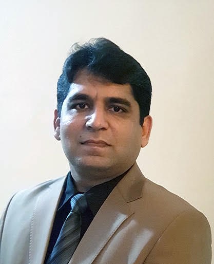
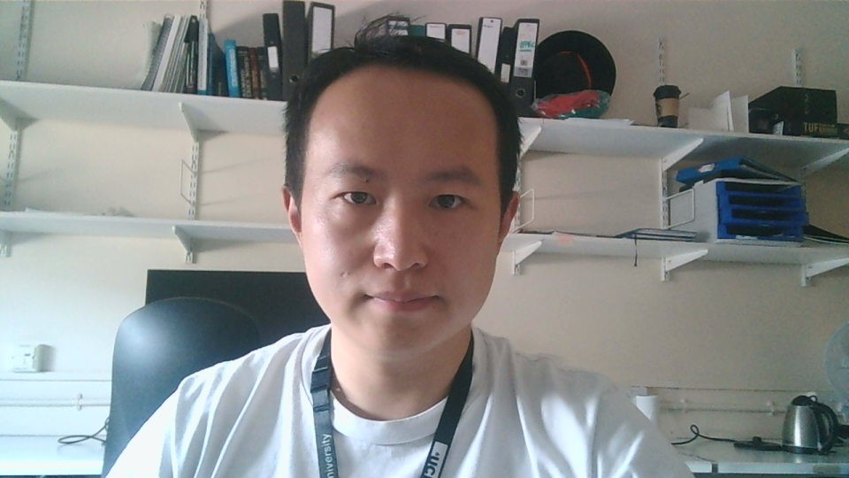
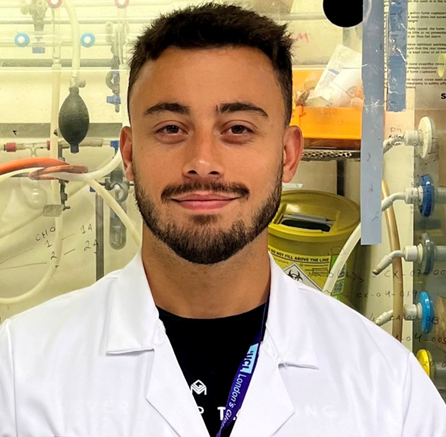
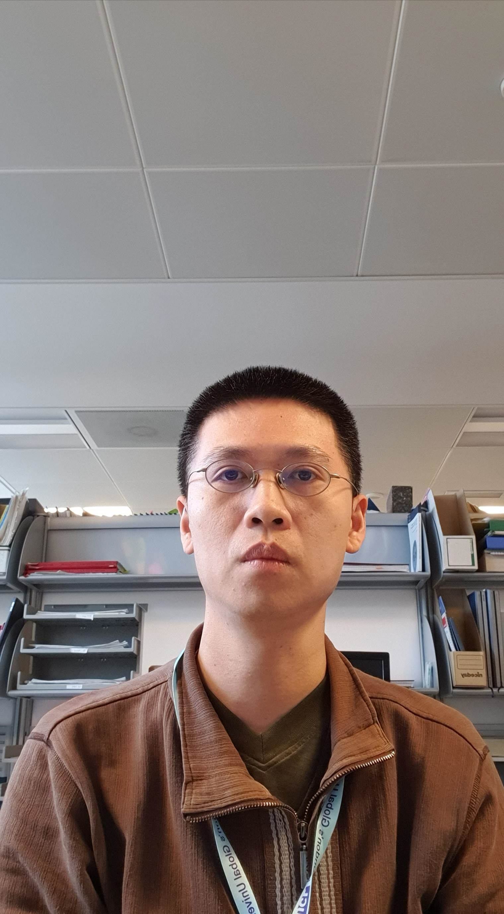
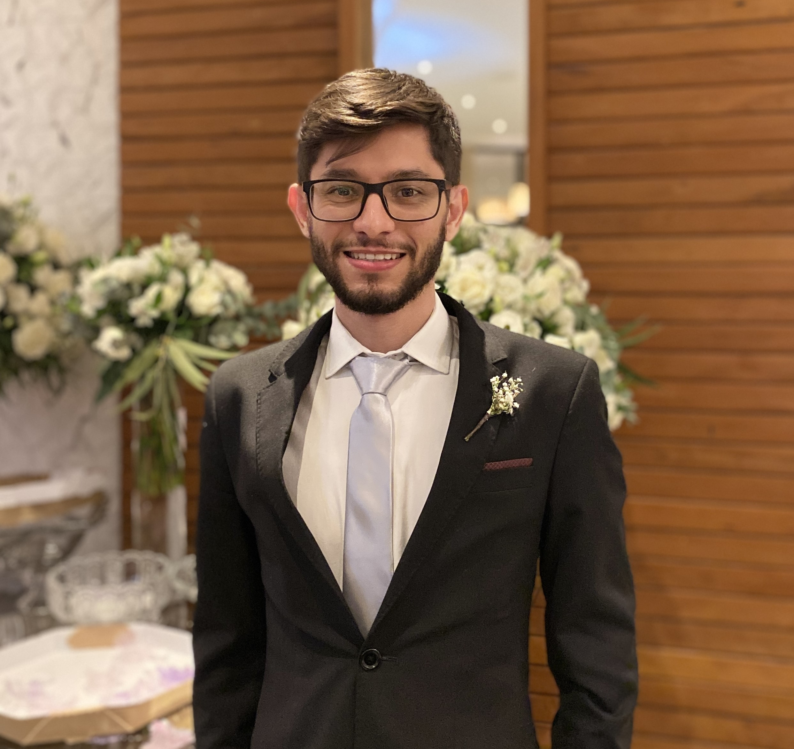
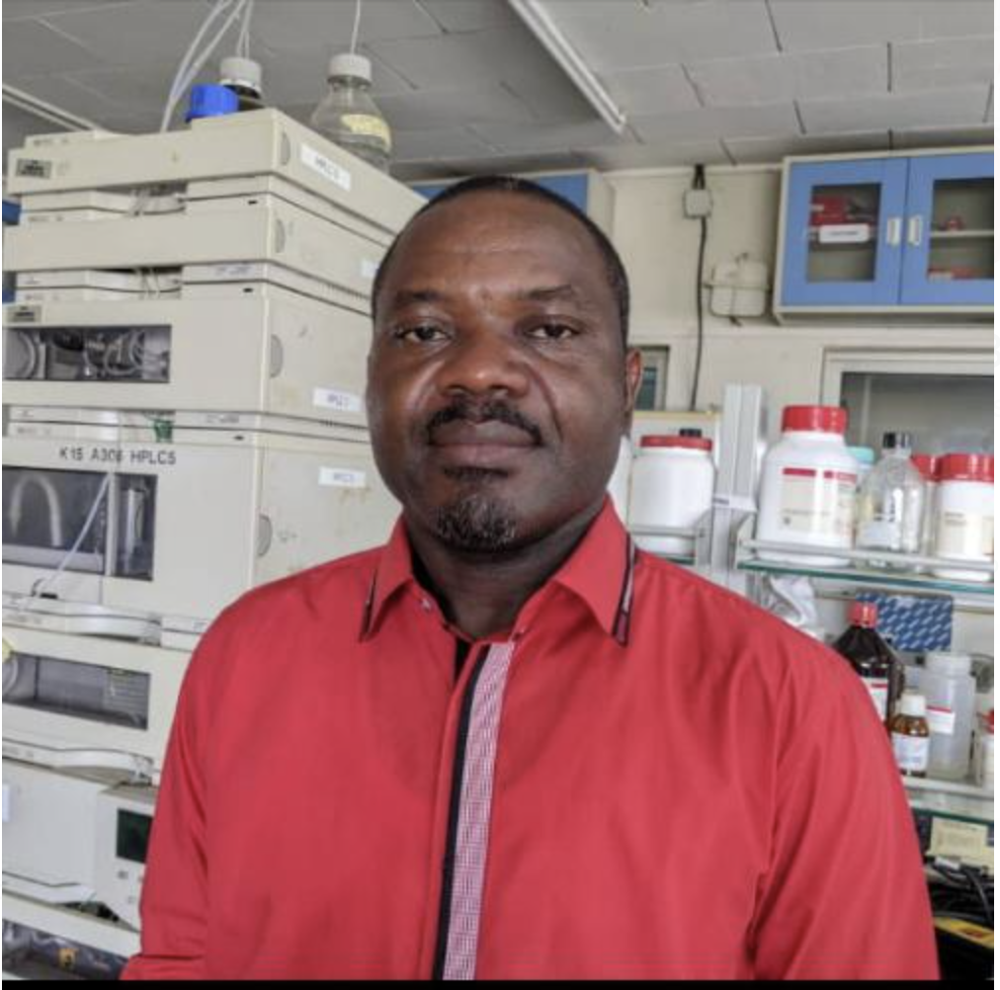

# Todd Group Alumni

(Hello lovely alumni - feel free to update your entries below. e.g. with what you're doing, or recent pictures.)

## University College London

|Name|Position|    Year    |Now|
|:------:|:------:|:------:|:------:|
|**Dr Dr Rahman Saleem**    |READDI-AViDD Project Coordinator (UCL School of Pharmacy)|2023-2025|LUMS University, Pakistan|
|**Dr Alvaro Magalhaes**    <a href="https://www.linkedin.com/in/alvaro-magalhaes/"><i class="fa fa-linkedin"></i></a>|Postdoc (UCL School of Pharmacy)|2023-2025|
|**Dr Hadia Almahli**    <a href="https://www.linkedin.com/in/hadia-almahli-09588656/?originalSubdomain=uk"><i class="fa fa-linkedin"></i></a>|Postdoc (UCL School of Pharmacy)|2023-2025|Assistant Professor at Bangor University|
|**Dr Xin Qiu**    <a href="https://www.linkedin.com/in/昕-xin-邱-qiu-804a1314a/"><i class="fa fa-linkedin"></i></a>|Postdoc (UCL School of Pharmacy)|2023-2025|
|**Dr Guilherme Fernandes**    <a href="https://www.linkedin.com/in/guilherme-fernandes-40400a93/"><i class="fa fa-linkedin"></i></a>|Postdoc (UCL School of Pharmacy)|2023-2025|Senior Scientist at The Francis Crick Institute|
|**Dr Wenjie Chen**    |Postdoc (UCL School of Pharmacy)|2023-2025|
|**Dr Dmitrij Melechov**    |PhD (UCL School of Pharmacy)|2019-2024|
|**Thomas Knight**    <a href="https://www.linkedin.com/in/thomas-knight-340784151/"><i class="fa fa-linkedin"></i></a>|PhD Student (UCL School of Pharmacy)|2021-2024|
|**Wellington Da Silva**    <a href="https://www.linkedin.com/in/wellingtondasilva1804/"><i class="fa fa-linkedin"></i></a>|Visiting Researcher (UCL Pharmacy)|2023-2024|PhD Student, State University of Campinas|
|**Dr Evans Mainsah Ngandung**    |Postdoctoral Research Associate (UCL School of Pharmacy)|2023-2024|Department of Chemistry and ANDI Centre of Excellence for Onchocerciasis Drug Research, University of Buea|
|**Yewon Oh**  |MPharm Student (UCL)|2022-2023|
|**Ju Hyeong Kim (Andy)**  |MPharm Student (UCL)|2022-2023|
|**Zhaohang Feng**    <a href="https://www.linkedin.com/in/yiwei-wang-65aab6251"><i class="fa fa-linkedin"></i></a>|MRes Student (UCL Pharmacy)|2022-2023|
|**Yiwei Wang**    <a href="https://www.linkedin.com/in/yiwei-wang-65aab6251"><i class="fa fa-linkedin"></i></a>|MRes Student (UCL Pharmacy)|2022-2023|
|**Guanghao Xu (Andy)**    <a href="https://www.linkedin.com/in/guanghao-xu-228083253"><i class="fa fa-linkedin"></i></a>|MRes Student (UCL Chem)|2022-2023|
|**Sanjana Thomas**    <a href="https://www.linkedin.com/in/sanjana-thomas-580b0a19b"><i class="fa fa-linkedin"></i></a>|MRes Student (UCL Chem)|2022-2023|
|**Mathamsanqa Bhebhe**    <a href="https://www.linkedin.com/in/mathamsanqa-bhebhe-b53281101/"><i class="fa fa-linkedin"></i></a> <a href="https://twitter.com/MNBhebhe"><i class="fa fa-twitter"></i></a>|PhD|2017-2022|
|**Edwin Tse**    <a href="https://www.linkedin.com/in/edwin-tse-92144155/"><i class="fa fa-linkedin"></i></a> <a href="https://twitter.com/edwintse_"><i class="fa fa-twitter"></i></a>|Postdoctoral Fellow|2021-2023|Postdoctoral Research Fellow at UNC|
|**Daniel Gedder Silva**    <a href="https://br.linkedin.com/in/daniel-gedder-73700529"><i class="fa fa-linkedin"></i></a> <a href="https://twitter.com/danielgedder"><i class="fa fa-twitter"></i></a>|Postdoctoral Fellow|2022-2023|
|**Kato Leonard**    <a href="https://www.linkedin.com/in/kato-leonard-075982209/"><i class="fa fa-linkedin"></i></a> <a href="https://twitter.com/katoleonard"><i class="fa fa-twitter"></i></a>|Erasmus|2021-2022|Advanced MSc in Plant Biotechnology, Ghent University|
|**Joshua Wyatt**  <a href="https://www.linkedin.com/in/joshuawyatt98"><i class="fa fa-linkedin"></i></a>|MSc|2022| Associate Consultant, Eradigm Consulting|
|**Isabella Sportelli**  <a href="https://www.linkedin.com/in/isabella-sportelli-258015188)"><i class="fa fa-linkedin"></i></a>|MSc|2022|Pharmaceutical Sciences Editor, Cactus Communications|
|**Faisal Rshaidat**  <a href="https://www.linkedin.com/in/faisal-rshaidat-9617731aa"><i class="fa fa-linkedin"></i></a>|MSc|2022|
|**Costanza Alciati**  <a href="https://www.linkedin.com/in/costanza-alciati-00551221b"><i class="fa fa-linkedin"></i></a>|MSc|2022|Inside Sales Representative, HungaroTrial CRO|
|**Manisha Kuttetira**  <a href="https://www.linkedin.com/in/manisha-kuttetira"><i class="fa fa-linkedin"></i></a>|MSc|2022|Consultant, Loop Horizon|
|**Jemima Haque**  <a href="https://www.linkedin.com/in/jemima-haque-34a1911b2/"><i class="fa fa-linkedin"></i></a>|Volunteer|2021|Research Scientist, Evotec|
|**Reuben McKay**    <a href="https://www.linkedin.com/in/reubenmckay/"><i class="fa fa-linkedin"></i></a>|MRes|2021|PhD, University of Bradford|
|**Giada Sabatino**    <a href="https://www.linkedin.com/in/giada-sabatino-77591b19b/"><i class="fa fa-linkedin"></i></a>|MRes|2021|PhD, Hochschule für Life Sciences FHNW|
|**Annika Ranta**  <a href="https://www.linkedin.com/in/annika-ranta"><i class="fa fa-linkedin"></i></a>|MSc|2021|CMC Regulatory Affairs Associate, AstraZeneca|
|**Wing Yin ("Jasmine") Tse**  <a href="https://www.linkedin.com/in/jasmine-tse-wing-yin"><i class="fa fa-linkedin"></i></a>|MSc|2021|
|**Mohammed ("Abid") Zaman**|MSc|2021|
|**Shuoping Rao**    <a href="https://www.linkedin.com/in/shuoping-rao-428995175/"><i class="fa fa-linkedin"></i></a>|MSc|2021|Investment Analyst at K2 Venture|
|**Hu Hong**|MSc|2021|
|**Mary Baffo**  <a href="https://www.linkedin.com/in/mary-baffo-4311b3195"><i class="fa fa-linkedin"></i></a>|MSc|2021|Regulatory Associate Scientist, Procter & Gamble|
|**Dayang Usop**    <a href="https://www.linkedin.com/in/dayangusop/"><i class="fa fa-linkedin"></i></a> <a href="https://twitter.com/DayangUsop"><i class="fa fa-twitter"></i></a>|MPharm|2020-2021| Provisionally Registered Pharmacist, Sarawak General Hospital|
|**Jia Lau**   |MPharm|2020-2021|
|**Fahima Idiris**    <a href="https://www.linkedin.com/in/fahima-idiris/"><i class="fa fa-linkedin"></i></a>|Postdoctoral Fellow|2019-2020|Associate Principal Chemist, Pharmaron|
|**Dana Klug**    <a href="https://uk.linkedin.com/in/dana-klug-9829259a"><i class="fa fa-linkedin"></i></a>|Postdoctoral Fellow|2019-2022|Medicinal Chemistry Project Leader, Arvinas|
|**Robert Hanson**  <a href="https://www.linkedin.com/in/robert-hanson-77073611/"><i class="fa fa-linkedin"></i></a>|Sabbatical Visitor|2020|Professor, Northeastern University|
|**Stephanie Deegan**  <a href="https://www.linkedin.com/in/stephaniedeegan"><i class="fa fa-linkedin"></i></a>|MSc|2020|Senior Associate Consultant, Cambridge Healthcare Research|
|**Ranu Gurung**  <a href="https://www.linkedin.com/in/ranu-gurung-54075216a"><i class="fa fa-linkedin"></i></a>|MSc|2020|EPR Configuration Analyst, The Royal Marsden NHS Foundation Trust|
|**Khushbu (Khush) Srivastava**  <a href="https://www.linkedin.com/in/khushbu-srivastava-ba28b8198"><i class="fa fa-linkedin"></i></a>|MSc|2020|Scientist, Rosalind Franklin Laboratory|
|**Saleni Pravin Kumar**|MSc|2020|
|**Neeracha ("Natt") Phungkuamchob**|MSc|2020|
|**Gareth (Bryn) Parry**  <a href="https://www.linkedin.com/in/bryn-parry"><i class="fa fa-linkedin"></i></a>|MSc|2019|Account Manager, Seven Stones Collective|
|**Luxsika Rajendra**  <a href="https://www.linkedin.com/in/luxsika-rajendra-7b6858151/"><i class="fa fa-linkedin"></i></a>|MSc|2019|Senior Clinical Trials Assistant, Nestlé Health Science|
|**Manisha Virdi**  <a href="https://www.linkedin.com/in/manisha-virdi-44251a147/"><i class="fa fa-linkedin"></i></a>|MSc|2019|Associate Vice President, Strategic Accounts, M3 Global Research|

## University of Sydney

|Name|Position|    Year    |Now|
|:------:|:------:|:------:|:------:|
|**Jamie Batten**    <a href="https://www.linkedin.com/in/james-michael-batten"><i class="fa fa-linkedin"></i></a>|PhD|2017-2021|Lead Chemistry Teacher, Matrix Education|
|**Marat Korsik**    <a href="https://www.linkedin.com/in/marat-korsik-590b64a1/"><i class="fa fa-linkedin"></i></a>|PhD|2017-2021|Regulator Scientist, Australian Industrial Chemicals Introduction Scheme|
|**Paul King**    <a href="https://www.linkedin.com/in/paul-king-00547874/"><i class="fa fa-linkedin"></i></a>|PhD|2017-2020|Patent Examiner, IP Australia|
|**Julius Adamson**|Honours|2018|PhD, The University of Sydney|
|**Nicholas Smith**|Honours|2018|PhD, The University of Sydney|
|**David Smith**  <a href="https://www.linkedin.com/in/david-smith-8366325a/"><i class="fa fa-linkedin"></i></a>|Postdoctoral Fellow|2017–18|Lecturer, Federation University Australia|
|**Conor Graham**  <a href="https://www.linkedin.com/in/conor-graham/"><i class="fa fa-linkedin"></i></a>|Honours|2017|Strategy and Buisness Operations Manager, Atlassian|
|**Malcolm Spain**  <a href="https://www.linkedin.com/in/malcolm-spain-79121817/"><i class="fa fa-linkedin"></i></a>|Postdoctoral Fellow|2015–17|Senior Scientist, Isomorphic Labs|
|**Sebastien Dath**  <a href="https://www.linkedin.com/in/sebastien-dath-352525232"><i class="fa fa-linkedin"></i></a>|Honours|2017|Change Officer, Transport for NSW|
|**Hung Phat Duong**  <a href="https://www.linkedin.com/in/hung-phat-duong-98a4b918b/"><i class="fa fa-linkedin"></i></a>|Honours|2017|PhD, The University of Sydney|
|**Ryan Macdonald**  <a href="https://www.linkedin.com/in/ryanjamesmac"><i class="fa fa-linkedin"></i></a>|Visiting Student  (University of Southampton)|2017|Data Modeler, UK Ministry of Defence|
|**Christopher Brown**  <a href="https://www.linkedin.com/in/christopher-brown-9a8291145/"><i class="fa fa-linkedin"></i></a>|Honours|2016|Medical Writer, McCann Health Australia|
|**Frank Jiang**|Honours|2016||
|**Alice Motion** (née Williamson)  [Personal Website](http://alicemotion.com/), <a href="https://en.wikipedia.org/wiki/Alice_Motion"><i class="fa fa-wikipedia-w"></i></a>|Postdoctoral Fellow|2012-16|[Associate Professor, University of Sydney](https://www.sydney.edu.au/science/about/our-people/academic-staff/alice-motion.html)|
|**Haochuan Mao**  <a href="https://www.linkedin.com/in/haochuan-mao-a14031173/"><i class="fa fa-linkedin"></i></a>|Visiting Student  (Nanjing University)|2016|PhD, Wasielewski Group, Northwestern University|
|**Hasini Murage**  <a href="https://www.linkedin.com/in/hasini-murage-3a1533b4/"><i class="fa fa-linkedin"></i></a>|Honours|2015|Co-design and Engagement Manager, Australian Government Department of Health and Aged Care|
|**Daniel Moawad**  <a href="https://www.linkedin.com/in/daniel-moawad-9b996b13b/"><i class="fa fa-linkedin"></i></a>|Honours|2015|Forensic Chemist, NSW Health Pathology|
|**Tianyi Zheng**  <a href="https://www.linkedin.com/in/tianyi-zheng-944524122/"><i class="fa fa-linkedin"></i></a>|Visiting Student  (Nanjing University)|2016|Scientist I, Chemistry, PTC Therapeutics|
|**Sandra Ast**  <a href="https://www.linkedin.com/in/sandraast"><i class="fa fa-linkedin"></i></a>|Postdoctoral Fellow|2013-15|Founder/CEO, AusSI Systems|
|**Anthony Lo**  <a href="https://www.linkedin.com/in/anthony-lo-a14ba8122/"><i class="fa fa-linkedin"></i></a>|PhD (w/ Trevor Hambley)|2010-14|Patent Attorney, Alder IP|
|**Tim Sheedy**  <a href="https://www.linkedin.com/in/timothy-sheedy-64aa3a82/"><i class="fa fa-linkedin"></i></a>|PhD (w/ Peter Rutledge)|2009-14|Analytical Chemist, AB Mauri|
|**Thomas MacDonald**  <a href="https://www.linkedin.com/in/thomas-macdonald-293096b9/"><i class="fa fa-linkedin"></i></a>|Honours|2014|Consultant - Energy Markets, Aurecon|
|**Swapnil Anam**|PhD|||
|**Jo Delbridge**|Honours|2014|Australian Government Department of Health|
|**Katrina Badiola**  <a href="https://www.linkedin.com/in/katrina-badiola-3a949a47"><i class="fa fa-linkedin"></i></a>|Honours|2013|Senior Scientist, Pharmaron|
|**Murray Robertson**  <a href="https://www.linkedin.com/in/murray-robertson-58b32939"><i class="fa fa-linkedin"></i></a>|Postdoctoral Fellow|2011-13|Associate Director for Digital CMC Research Operations, Continuous Manufacturing and Advanced Crystallisation (CMAC) Future Manufacturing Research Hub|
|**Mingfeng Yu**  <a href="https://www.linkedin.com/in/mingfeng-felix-yu-b8591636/"><i class="fa fa-linkedin"></i></a>|PhD|2009-13|Postdoctoral Fellow, University of South Australia|
|**Nilupa Amarasinghe**  <a href="https://www.linkedin.com/in/nilupa-amarasinghe-9476b515/"><i class="fa fa-linkedin"></i></a>|PhD|2009-13|Senior Lecturer, [University of Peradeniya](http://ahs.pdn.ac.lk/dept_and_unit/Pharmacy_/acd_staff/DrNilupaAmarasinghe)|
|**Althea Tsang**  <a href="https://www.linkedin.com/in/althea-tsang-145a3382/"><i class="fa fa-linkedin"></i></a>|PhD|2009-13|Patent Attorney at [Davies Collison Cave]((http://www.davies.com.au/people/althea-tsang))|
|**Patrick Crisologo**|Honours (w/ Peter Rutledge)|2013||
|**Matin Dean**  <a href="https://www.linkedin.com/in/matin-dean-17891984/"><i class="fa fa-linkedin"></i></a>|Graduate Diploma|2012|Science Teacher, Narrabundah College|
|**Jim Cronshaw**|Honours|2012|Year IV Medicine/Surgery, ANU|
|**Soo Jean Park**  <a href="https://www.linkedin.com/in/soo-jean-park-01863b32"><i class="fa fa-linkedin"></i></a>|PhD|2009-12|Postdoctoral Fellow, Macquarie University|
|**Paul Ylioja**  <a href="https://www.linkedin.com/in/paulylioja/"><i class="fa fa-linkedin"></i></a>|Postdoctoral Fellow|2011-12|Consultant at [RPA Risks and Policy Analysts](http://www.rpaltd.co.uk/)|
|**Clara Shen**  <a href="https://www.linkedin.com/in/clarashen/"><i class="fa fa-linkedin"></i></a>|TSP Undergraduate|||
|**Qun Yu**  <a href="https://www.linkedin.com/in/dr-qun-yu-a8b088100/"><i class="fa fa-linkedin"></i></a>|Postdoctoral Fellow|2010-12|Higher Education Consultant, Darlo Higher Education|
|**Cale Burge**  <a href="https://www.linkedin.com/in/cale-burge-7b55b83a/"><i class="fa fa-linkedin"></i></a>|TSP Undergraduate|2012||
|**Sarah Carman**  <a href="https://www.linkedin.com/in/sarahcarman/"><i class="fa fa-linkedin"></i></a>|TSP Undergraduate|2012|Founder, Sponge Education, and Teacher, Redlands|
|**Matthew Tarnowski**  <a href="https://www.linkedin.com/in/matt-tarnowski/"><i class="fa fa-linkedin"></i></a>|TSP Undergraduate|2012|PhD, University of Bristol|
|**Angus Jones**|Graduate Diploma (w/ Peter Rutledge)|2011-12||
|**Michael Woelfle**  <a href="https://www.linkedin.com/in/michael-w%C3%B6lfle-03118b33"><i class="fa fa-linkedin"></i></a>|Postdoctoral Fellow|2009-2011|Process Expert & Validation Expert, Novartis|
|**Ahamed Muneer**|PhD|2007-11|Senior Research Fellow, [SAHMRI](https://www.sahmri.org/)|
|**Zoe Hungerford**|Undergraduate|2011||
|**Jack Orford**  <a href="https://www.linkedin.com/in/jackorford/"><i class="fa fa-linkedin"></i></a>|Honours (w/ Peter Rutledge)|2011|Counsel, Davis Polk & Wardwell LLP|
|**Cyril Tang**  <a href="https://www.linkedin.com/in/cyril-tang-65665462/"><i class="fa fa-linkedin"></i></a>|TSP Undergraduate (w/ Peter Rutledge)||Junior Doctor, Hunter New England Local Health District|
|**Thiru Thirukkumaran**|MSc|||
|**Victor Sun**|Honours|2009||
|**Laura White**|TSP Undergraduate|||
|**Yu Heng Lau**  <a href="https://www.linkedin.com/in/yuhenglau/"><i class="fa fa-linkedin"></i></a>|Honours|2009|Lecturer, The University of Sydney|
|**Tomasz Wyczesany**|PhD|2004-8|Honorary Research Associate, University of Sydney, and Development Chemist, Alpha Chemical|
|**Taliesha Paine**  <a href="https://www.linkedin.com/in/taliesha-paine-193607a0"><i class="fa fa-linkedin"></i></a>|Honours|2007-8|Medical Science Liaison, Otsuka|
|**Milena Milewska**|Honours|2007||
|**Candy Chun**|Honours|2007||
|**Adi Ramana**|Postdoctoral Fellow|2006-7|Senior Scientist, [Heterodrugs Ltd](http://www.hetero.com/), Hyderabad, India|
|**Wing Yan Leung**|Honours|2006||

## Queen Mary University of London

|        Name        |Position|    Year    |Now|
|:------:|:------:|:------:|:------:|
|**Shaimaa  El-Fayyoumy**  <a href="https://www.linkedin.com/in/shaimaa-el-fayyoumy/"><i class="fa fa-linkedin"></i></a>|PhD|2003-07|Technical Sales and Product Manager,  De Monchy International B.V.|
|**Mohammed Al-Hashimi**  <a href="https://www.linkedin.com/in/malhashimi/"><i class="fa fa-linkedin"></i></a>|Project student|2002-03|Research Associate Professor,  Texas A&M at Qatar|
|**Rabab Toubar**  <a href="https://www.linkedin.com/in/rabab-toubar-4a8ba716/"><i class="fa fa-linkedin"></i></a>|Chevening Scholar, then PhD  at University of Massachusetts Lowell|2003-04|Assistant Lecturer at Ain Shams University|
|**Nisarg Pipalia**  <a href="https://www.linkedin.com/in/nisarg-pipalia-51872b7b/"><i class="fa fa-linkedin"></i></a>|MSc|2003-04|Doctor, NHS|
