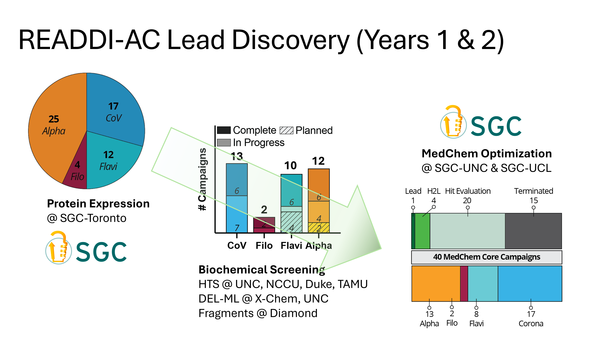

    <!-- Page Title -->
    

        <h1 class="text-5xl font-extrabold text-brand-dark mb-6">Research</h1>
        

            

                We are most known for the <a href="https://github.com/OpenSourceMalaria" class="text-brand-primary hover:underline font-bold">Open Source Malaria</a> project, our <a href="http://www.nature.com/nchem/journal/v3/n10/full/nchem.1149.html" class="text-brand-primary hover:underline font-bold">open science</a> work more generally and for the use of <a href="http://dx.doi.org/10.1039/C0CS00143K" class="text-brand-primary hover:underline font-bold">click-derived triazoles in chemical sensing</a>. However, there are plenty of other projects that interest us. See our new <a href="./idler.html" class="text-brand-primary hover:underline font-bold">Idler compounds</a> section for the live library, protocol, and data resources.
            

        

    

    <!-- Quick Navigation (Pill Design) -->
    

        
Jump to Section

        

            <a href="#open_science" class="px-5 py-2 bg-white border border-slate-200 text-slate-600 rounded-full hover:border-brand-primary hover:text-brand-primary hover:shadow-md transition-all text-sm font-bold no-underline">Open Science</a>
            <a href="#synthetic_methodology" class="px-5 py-2 bg-white border border-slate-200 text-slate-600 rounded-full hover:border-brand-primary hover:text-brand-primary hover:shadow-md transition-all text-sm font-bold no-underline">Synthetic Methodology</a>
            <a href="#asymmetric_catalysis" class="px-5 py-2 bg-white border border-slate-200 text-slate-600 rounded-full hover:border-brand-primary hover:text-brand-primary hover:shadow-md transition-all text-sm font-bold no-underline">Asymmetric Catalysis</a>
            <a href="#chemical_education" class="px-5 py-2 bg-white border border-slate-200 text-slate-600 rounded-full hover:border-brand-primary hover:text-brand-primary hover:shadow-md transition-all text-sm font-bold no-underline">Chemical Education</a>
            <a href="#automated_synthesis_planning" class="px-5 py-2 bg-white border border-slate-200 text-slate-600 rounded-full hover:border-brand-primary hover:text-brand-primary hover:shadow-md transition-all text-sm font-bold no-underline">Automated Synthesis Planning</a>
        

    

    <!-- ==========================================================================
         OPEN SCIENCE SECTION
         ========================================================================== -->
    

        

            

                <i class="fas fa-lock-open text-2xl"></i>
            

            <h2 class="text-3xl font-bold text-brand-dark m-0">Open Science</h2>
        

        

            
We live in the age of the internet, one of the most transformative inventions of our time. Computer scientists understood what the internet meant - working together without barriers. Scientists are just catching up. We could collaborate in more productive ways if only we were less wedded to secrecy.

            
We have adopted open source principles to experimental lab science. The first project successfully used this idea to find a way of producing the important drug praziquantel (used to treat the dreadful disease <a href="http://en.wikipedia.org/wiki/Schistosomiasis" class="text-brand-primary hover:underline font-bold">Schistosomiasis</a>) as a single enantiomer. All data and ideas were freely shared and anybody could take part. People did - about 30, and the problem was more quickly solved than we could have alone because strangers came along and contributed where they were able to. The science was published <a href="http://www.plosntds.org/article/info%3Adoi%2F10.1371%2Fjournal.pntd.0001260" class="text-brand-primary hover:underline font-bold">here</a> (check out the awesome links to actual lab notebook pages) and the way we did it was published separately in <a href="http://www.nature.com/nchem/journal/v3/n10/full/nchem.1149.html" class="text-brand-primary hover:underline font-bold">Nature Chemistry</a>. The website where it all got started was <a href="http://www.thesynapticleap.org/node/286" class="text-brand-primary hover:underline font-bold">The Synaptic Leap</a> and all the work was described in <a href="http://www.ourexperiment.org/racemic_pzq" class="text-brand-primary hover:underline font-bold">an online electronic lab notebook (ELN)</a>.

            
This made us think, what about drug discovery? Could we discover new drugs using an open approach and without patents? So, we started a project to see if this works and we're now driving the Open Source Malaria project, a fully open, borderless, patentless drug discovery project for malaria that aims to discover a compound that will enter Phase I clinical trials. It's a fantastically exciting project made possible by the continual contributions of a scientists around the world.

            
We've also founded several other consortia, below. All of these generally follow the <a href="https://chemistry-europe.onlinelibrary.wiley.com/doi/full/10.1002/cmdc.201900565" class="text-brand-primary hover:underline font-bold">Six Laws</a> in how they operate - these laws (which are guidelines, really, for those of you who don't like laws) were derived <em>post facto</em>, i.e. from what worked best and was simplest for everyone to understand.

            
We need a good place to capture all the discussion that the idea of open source drug discovery has created (it's a lot) but some examples will be collated here, like <a href="https://itsfoss.com/open-source-impact-on-science/" class="text-brand-primary hover:underline font-bold">this</a> and <a href="https://rbharath.github.io/why-should-drug-discovery-be-open-source/" class="text-brand-primary hover:underline font-bold">this</a>.

            <!-- Licenses & Non-profit Block -->
            

                

                    <h3 class="text-xl font-bold text-brand-dark mb-3">Licences</h3>
                    
There is no adequate licence to cover entire open source drug discovery projects. Open Source Malaria and others use the CC-BY licence. <a href="https://www.nature.com/articles/d41586-019-01720-7" class="text-brand-primary hover:underline">Data should abide by the FAIR principles</a>. <a href="https://www.nature.com/articles/d41586-019-01715-4" class="text-brand-primary hover:underline">Linking those who generate data with the downstream use of that data</a> (for credit) might be desirable.

                

                

                    <h3 class="text-xl font-bold text-brand-dark mb-3">Non-profit Pharma Synthesis</h3>
                    
<a href="https://nonprofitquarterly.org/the-new-nonprofit-pharmaceutical-world-whats-up-with-that/" class="text-brand-primary hover:underline">General article</a>. <a href="https://civicarx.org/media/" class="text-brand-primary hover:underline">CivicaRx</a>.

                

            

        

        <h3 class="text-xl font-bold text-brand-dark mt-12 mb-6 uppercase tracking-widest border-b border-slate-100 pb-2">Active Projects</h3>

        <!-- ACCORDION CONTAINER -->
        

            <!-- PROJECT 1: Antivirus -->
            

                

                    <h2 class="text-xl font-bold text-brand-dark m-0 group-hover:text-brand-primary transition-colors">Open Source Antivirus</h2>
                    <i id="icon-antivirus" class="fas fa-chevron-down text-slate-400 chevron group-hover:text-brand-primary"></i>
                

                

                    

                        
With an aim to identify orally available small organic molecule-based drugs for the treatment and prevention of viral infection, the Todd group/The Structural Genomics Consortium (SGC)@UCL is collaborating with the Rapidly Emerging Antiviral Drug Development Initiative (READDI). The collaboration is funded by the National Institute of Health (NIH) through the <a href="https://readdi.org/stories/readdi-receives-65m-grant-from-nih-to-establish-an-antiviral-drug-discovery-avidd-center/" class="text-brand-primary hover:underline font-bold">READDI-AViDD project</a>, specifically focused on viruses with potential for large global negative impact.

                        
The collaboration is driven by identification and isolation of viral target proteins, establishing assays and high-throughput screening of various commercial, non-commercial and in-house libraries. We are leading the MedChem optimization campaigns with current focus on targeting viruses including SARS-Cov2, Dengue, Chikv. The aim is to identify hits that can act as starting points for further medicinal chemistry development, that can eventually lead to new drugs to combat viral infections of potential to spread widely and globally.

                        
As with our other Open Science Projects, all generated data is available online and updated regularly. The <a href="https://docs.google.com/spreadsheets/d/1TanvenS56FovmyT8BoxloH2iHP4jjVcusho2F5nwDeU/edit?gid=117188155#gid=117188155" class="text-brand-primary hover:underline font-bold">READDI-AViDD Pipeline</a> provides the current status of various projects and links to repositories of individual projects.

                        

                            
                        

                    

                

            

            <!-- PROJECT 2: Antibiotics -->
            

                

                    <h2 class="text-xl font-bold text-brand-dark m-0 group-hover:text-brand-primary transition-colors">Open Source Antibiotics</h2>
                    <i id="icon-antibiotics" class="fas fa-chevron-down text-slate-400 chevron group-hover:text-brand-primary"></i>
                

                

                    

                        

                            <h3 class="text-2xl font-bold text-brand-dark m-0">Open Source Antibiotics</h3>
                            <a href="https://twitter.com/OSantibiotics" class="text-slate-400 hover:text-brand-primary transition"><i class="fab fa-twitter text-xl"></i></a>
                        

                        
We founded the <a href="https://github.com/opensourceantibiotics/GeneralTopics" class="text-brand-primary hover:underline font-bold">Open Source Antibiotics</a> (OSA) consortium to apply our open source way of working to the discovery of new, inexpensive medicines for bacterial infections. There are currently two series in the OSA consortium.

                        
                        

                            
<a href="https://github.com/opensourceantibiotics/murligase" class="hover:text-brand-primary">OSA Series 1 - Mur ligases</a>

                            
The focus is the discovery and development of new antibiotics, specifically inhibitors of the Mur ligase enzymes using a fragment based approach.

                            

                                
                            

                            
OSA Series 1 project focused on structural modifications of a potent MurC inhibitor AZ5595, <a href="https://pubs.acs.org/doi/10.1021/cb500360c" class="text-brand-primary hover:underline font-bold">developed by AstraZeneca through a lead modification campaign</a>. Despite having single digit nanomolar activities against Eco and Pae MurC, it suffered from permeability issues and bacterial efflux mechanisms, and thereby failed to translate such potency to antibacterial activity against wild-types.

                            
Initially, we brought in the eNRTy rules from <a href="https://www.nature.com/articles/nature22308" class="text-brand-primary hover:underline font-bold">Hergenrother’s</a> <a href="https://pubs.acs.org/doi/full/10.1021/acsinfecdis.0c00715" class="text-brand-primary hover:underline font-bold">team</a>: replacing the alcohol group in AZ5595 (and other potent derivatives) with amine, guanidinium or pyridinium groups as well as introducing strengthened rigidity (less rotational bonds) in pursuit of a better accumulation in bacteria.

                            
Considering Mur ligases share a highly conserved active site across enzyme types and bacterial species, further multi-targeting modifications (bioisostere replacement, ligand growing, and scaffold hopping) were implemented in hope of obtaining better binding interactions (especially targeting the active site helix which originally binds the ADP phosphate group) and improved binding pocket compatibility (reduce the potential steric clashes with Mur ligase C-terminus). <a href="https://onlinelibrary.wiley.com/doi/full/10.1111/mmi.12758" class="text-brand-primary hover:underline font-bold">Learn more here</a>.

                            

                                
                            

                        

                        

                            
<a href="https://github.com/opensourceantibiotics/Series-2-Diarylimidazoles" class="hover:text-brand-primary">OSA Series 2 - Diarylimidazoles</a>

                            
This project involved the optimisation of a series of molecules discovered at the University of North Carolina Chapel Hill and has been <a href="https://pubs.acs.org/doi/10.1021/acsinfecdis.3c00286" class="text-brand-primary hover:underline font-bold">published</a>. The molecules are easy to make and show promise against MRSA. We worked completely openly (for example, recording our <a href="https://www.youtube.com/playlist?list=PL0eLxnHhou_k1Upbn5X1mdHBwKMYkRpLH" class="text-brand-primary hover:underline font-bold">research meetings</a>. The core funding, arising from a grant from Pharmalliance, successfully elicited contributions from talented external groups, including the private sector - Hypha drug discovery. Sharing of molecules with other groups ensured we could extract additional value from them in <a href="https://pubs.acs.org/doi/10.1021/acsinfecdis.3c00040" class="text-brand-primary hover:underline font-bold">other projects</a>.

                            

                                
                            

                            
If you have a series you'd like to explore in this way - perhaps something you've paused, or something you'd like to get off the ground - get in touch.

                        

                    

                

            

            <!-- PROJECT 3: Malaria -->
            

                

                    <h2 class="text-xl font-bold text-brand-dark m-0 group-hover:text-brand-primary transition-colors">Open Source Malaria</h2>
                    <i id="icon-malaria" class="fas fa-chevron-down text-slate-400 chevron group-hover:text-brand-primary"></i>
                

                

                    

                        

                            <h3 class="text-2xl font-bold text-brand-dark m-0">Open Source Malaria</h3>
                            <a href="https://twitter.com/o_s_m" class="text-slate-400 hover:text-brand-primary transition"><i class="fab fa-twitter text-xl"></i></a>
                        

                        
Malaria is a debilitating disease with more than 230 million infections and half a million deaths a year, mostly children. The continual development of resistance by the relevant Plasmodium parasite means that it is crucial to develop medicines with novel mechanisms of action if we are to combat the disease effectively, to complement the use of other measured like bed nets and vaccines.

                        
Mat founded the <strong>Open Source Malaria (OSM) Consortium</strong> in 2011 with the Medicines for Malaria Venture (<a href="https://github.com/OpenSourceMalaria" class="text-brand-primary hover:underline font-bold">Github</a>). OSM carries out open source drug discovery: hit to lead and lead optimisation projects using public domain starting points. The first three series, below, derived from molecules discovered by GSK Tres Cantos, and the fourth series derives from a series discovered by Pfizer. Series 1 was <a href="https://pubs.acs.org/doi/10.1021/acscentsci.6b00086" class="text-brand-primary hover:underline font-bold">published</a>. Series 2 was paused when it was realised that we were working on these molecles at the same time as a closed group, and we wanted to avoid duplication of effort.

                        

                            
                        

                        
The starting point of <a href="https://github.com/OpenSourceMalaria/Series3" class="text-brand-primary hover:underline font-bold">Series 3</a>, OSM-S-106, a thienopyrimidine-based sulfonamide, showed promise due to its potency, solubility, low toxicity, and low molecular weight. Originally we were unable to improve it and paused the project. However, our recent <a href="https://www.nature.com/articles/s41467-024-45224-z" class="text-brand-primary hover:underline font-bold">paper</a> carried out by PhD student Yinuo Wang have demonstrated that OSM-S-106 targets <em>Plasmodium falciparum</em> asparagine tRNA synthetase (PfAsnRS) through a very cool “reaction hijacking” mechanism in which the molecule reacts with the tRNA-amino acid adduct to create a new asparagine adduct of OSM-S-106. We are now optimising OSM-S-106 to see if we can improve its potency a little such that it can enter preclinical evaluation.

                        
Based on these results, we've become curious about the activity of other amino acid derivatives of OSM-S-106. It's likely that Yinuo's PhD will focus on synthesizing a complete set of such adducts to share with the community. The most recent proline adduct (MMV2240865) has shown promising results, with an activity of 3 nM against the 3D7 strain.

                        

                            
                        

                        
<em>Notes needed here about Series 4</em>. In 2019-2020, with funding from EPSRC/AI3SD, OSM ran a predictive modelling competition to figure out whether new methods in artificial intelligence and machine learning could help predict new active molecules in a phenotypic drug discovery project (where we had no detailed structure of the biological target). Here is the <a href="https://eprints.soton.ac.uk/438123/" class="text-brand-primary hover:underline font-bold">report of the Jan 2020 meeting</a> we ran, the <a href="https://github.com/OpenSourceMalaria/Series4_PredictiveModel" class="text-brand-primary hover:underline font-bold">relevant Github repository</a> and the <a href="https://chemrxiv.org/articles/preprint/An_Open_Drug_Discovery_Competition_Experimental_Validation_of_Predictive_Models_in_a_Series_of_Novel_Antimalarials/13194755" class="text-brand-primary hover:underline font-bold">preprint</a>.

                        
                        

                            (A brief note on the Pied Piper role. Open source projects benefit from a coordinator, to guide, assimilate, reach out. This is often referred to as a <a href="https://en.wikipedia.org/wiki/Pied_Piper_of_Hamelin" class="text-brand-primary hover:underline">Pied Piper</a> role, but a <em>much</em> better analogy is the <a href="https://en.wikipedia.org/wiki/James_Murray_(lexicographer)" class="text-brand-primary hover:underline">James Murray</a> role.)
                        

                        
                        

                            <a href="http://www.youtube.com/user/OSDDMalaria" class="text-brand-primary hover:underline">YouTube channel</a> all now old.
                        

                    

                

            

            <!-- PROJECT 4: Mycetoma -->
            

                

                    <h2 class="text-xl font-bold text-brand-dark m-0 group-hover:text-brand-primary transition-colors">Open Source Mycetoma</h2>
                    <i id="icon-mycetoma" class="fas fa-chevron-down text-slate-400 chevron group-hover:text-brand-primary"></i>
                

                

                    

                        

                            <h3 class="text-2xl font-bold text-brand-dark m-0">Open Source Mycetoma</h3>
                            <a href="https://twitter.com/MycetOS" class="text-slate-400 hover:text-brand-primary transition"><i class="fab fa-twitter text-xl"></i></a>
                        

                    

                

            

            <!-- PROJECT 5: Pharma -->
            

                

                    <h2 class="text-xl font-bold text-brand-dark m-0 group-hover:text-brand-primary transition-colors">Open Source Pharma</h2>
                    <i id="icon-pharma" class="fas fa-chevron-down text-slate-400 chevron group-hover:text-brand-primary"></i>
                

                

                    

                        

                            <h3 class="text-2xl font-bold text-brand-dark m-0">Open Source Pharma</h3>
                            <a href="https://twitter.com/opensrcpharma" class="text-slate-400 hover:text-brand-primary transition"><i class="fab fa-twitter text-xl"></i></a>
                        

                        
We've co-founded a broader open source pharma movement which has been defined by participants from across the public and private sectors, with early backing from Open Society Foundations, The Rockefeller Foundation and Tata Trusts. The idea is to promote more open forms of collaboration towards "Medicines for All". The underlying ideas were discussed at WHO in 2013 (<a href="https://www.youtube.com/playlist?list=PLyNnVQbuVDGUoKnHcazuExFE5aCaTtn8V" class="text-brand-primary hover:underline font-bold">Is Open Source Drug Discovery Practical?</a>, <a href="https://www.who.int/tdr/news/2013/odd/en/" class="text-brand-primary hover:underline font-bold">WHO News Item</a>), and guiding principles were established at a <a href="https://www.opensourcepharma.net/bellagio.html" class="text-brand-primary hover:underline font-bold">meeting</a> in 2014 (<a href="https://www.who.int/tdr/news/2014/open-source-pharma-mtg/en/" class="text-brand-primary hover:underline font-bold">WHO News Item</a>) with further <a href="https://www.opensourcepharma.net/conferences.html" class="text-brand-primary hover:underline font-bold">conferences</a> in 2015 and 2019. The overall approach is described in a short <a href="https://journals.plos.org/plosmedicine/article?id=10.1371/journal.pmed.1002276" class="text-brand-primary hover:underline font-bold">2017 "Roadmap" paper</a> (with more details provided in the longer <a href="https://journals.plos.org/plosmedicine/article?id=10.1371/journal.pmed.1002276#sec006" class="text-brand-primary hover:underline font-bold">supporting information</a> document).

                        
(Associated Articles/Media: <a href="https://www.cbc.ca/player/play/2523952984" class="text-brand-primary hover:underline font-bold">2014 Canadian Radio interview "Can open-source pharma cure Ebola and other neglected killers?"</a>.

                        
There are many and repeated calls for different ways to discover and develop medicines, in particular for better panedemic preparedness (e.g. <a href="https://blogs.bmj.com/bmj/2021/04/01/preparing-for-the-next-pandemic-requires-public-health-focused-industrial-policy/" class="text-brand-primary hover:underline font-bold">here</a>)

                        
There are many other possible means of funding open models of drug discovery. One is <a href="https://medium.com/molecule-blog/an-open-bazaar-for-drug-development-molecule-protocol-a47978dd914" class="text-brand-primary hover:underline font-bold">blockchain</a>. Another, that we're involved in, is the use of existing market instruments like regulatory data exclusivity - see our company <a href="https://www.m4idpharma.com/" class="text-brand-primary hover:underline font-bold">M4ID</a>. One wonders whether some of <a href="https://github.com/nayafia/lemonade-stand/blob/master/README.md" class="text-brand-primary hover:underline font-bold">the methods for funding open source software</a> might be translatable to drug discovery.

                    

                

            

            <!-- PROJECT 6: TB -->
            

                

                    <h2 class="text-xl font-bold text-brand-dark m-0 group-hover:text-brand-primary transition-colors">Open Source Tuberculosis</h2>
                    <i id="icon-tb" class="fas fa-chevron-down text-slate-400 chevron group-hover:text-brand-primary"></i>
                

                

                    

                        

                            <h3 class="text-2xl font-bold text-brand-dark m-0">Open Source Tuberculosis</h3>
                            <a href="https://twitter.com/opensourcetb" class="text-slate-400 hover:text-brand-primary transition"><i class="fab fa-twitter text-xl"></i></a>
                        

                        
Mat founded the <a href="https://github.com/OpenSourceTB/OSTB_General_Start_Here" class="text-brand-primary hover:underline font-bold">Open Source Tuberculosis (OSTB) Consortium</a> and there are currently three compound series.

                        

                            
                        

                        
<strong><a href="https://github.com/OpenSourceTB/OSTB_Series_1/wiki/What-is-OSTB-Series-1%3F" class="text-brand-primary hover:underline font-bold">OSTB Series 1</a></strong> - <em>The spiro series</em>

                        
Many of the compounds in this series displayed high potency vs <em>M.tb</em> but a significant risk of hERG inhibition and a lower-than-desired <em>in vivo</em> tolerability combined lead us to park the series. The series was publish in <a href="https://pubs.acs.org/doi/10.1021/acs.jmedchem.8b01533" class="text-brand-primary hover:underline font-bold">J. Med. Chem.</a> in 2018 and all the <a href="https://github.com/OpenSourceTB/OSTB_Series_1/wiki/Sources-of-Data" class="text-brand-primary hover:underline font-bold">data</a> is available for anyone to pursue.

                        
<strong><a href="https://openwetware.org/wiki/OpenSourceTB:OSTB_Series_2" class="text-brand-primary hover:underline font-bold">OSTB Series 2</a></strong> - <em>Imidazopyridines</em>

                        
<strong>OSTBS27</strong> was identified by GSK in a high throughput screen. <strong>OSTBS27</strong> is active against both replicating <em>M.tb</em> (MIC vs. H37Rv = 10 μM) and non-replicating TB (>50% inhibition in 10 experiments out of 13) with mean PXC50 of 5.2 μM. The project is currently available for anyone to pursue.

                        
<strong><a href="https://github.com/OpenSourceTB/OSTB_Series_3/wiki" class="text-brand-primary hover:underline font-bold">OSTB Series 3</a></strong> - <em>Small molecule inhibitors of non-replicating M.tb</em>

                        
<strong>OSTBS83</strong> was identified by GSK and Cornell University in <a href="https://pubs.acs.org/doi/10.1021/acsinfecdis.5b00025" class="text-brand-primary hover:underline font-bold">2015</a> as a selective inhibitor of non-replicating <em>M.tb</em> (NR IC90 = 2.01 μM). This project is <a href="https://github.com/OpenSourceTB/OSTB_Series_3" class="text-brand-primary hover:underline font-bold">active</a> and to date <a href="https://docs.google.com/spreadsheets/d/1z2cjYPx4elBNuZOQjKd0Gn4aTQMz_W58dztc1uYSpZg/edit#gid=0" class="text-brand-primary hover:underline font-bold">&gt; 60 compounds</a> have been evaluated for activity against non-replicating M.tb, in a pursuit to develop a new drug for <a href="https://www.who.int/tb/areas-of-work/preventive-care/ltbi_faqs/en/" class="text-brand-primary hover:underline font-bold">latent tuberculosis</a>.

                        
<em>Contributions to this project are welcomed.</em>

                    

                

            

            <!-- PROJECT 7: Contraceptives -->
            

                

                    <h2 class="text-xl font-bold text-brand-dark m-0 group-hover:text-brand-primary transition-colors">Non-hormonal Contraceptives</h2>
                    <i id="icon-contraceptives" class="fas fa-chevron-down text-slate-400 chevron group-hover:text-brand-primary"></i>
                

                

                    

                        
The Structural Genomics Consortium (SGC) has been funded by the Bill & Melinda Gates Foundation to generate protein reagents and chemical probes for several potential drug targets for new, safe and effective non-hormonal contraceptives. Contraceptives allow informed choices about family planning. Research into non-hormonal contraceptives is important due to concerns over the safety and side effects of current hormonal methods.

                        
Two promising protein targets we are working on are phospholipase C zeta 1 (PLCζ1) and α/β hydrolase domain 2 (ABHD2). For both targets, we have successfully expressed and purified functional protein and developed a biochemical screening assay to identify inhibitors of activity.

                        
For PLCζ1, we are planning several screens including a DEL (DNA-encoded library) screen and ASMS (affinity selection mass spectrometry) screen, from which we hope to identify chemical probes.

                        
We have developed small molecule inhibitors of ABHD2 and are using these to investigate the mechanism of this protein.

                        
The wikis are <a href="https://github.com/StructuralGenomicsConsortium/CNP5-PLCZ1/wiki" class="text-brand-primary hover:underline font-bold">here</a> for PLCz1 and <a href="https://github.com/StructuralGenomicsConsortium/CNP6-ABHD2/wiki" class="text-brand-primary hover:underline font-bold">here</a> for ABHD2.

                        

                            
                        

                    

                

            

        

       

        

            

                

                    <i class="fas fa-flask text-2xl"></i>
                

                <h2 class="text-3xl font-bold text-brand-dark m-0">Synthetic Methodology</h2>
            

            

                
The group's motto is <em>To make the right molecule in the right place at the right time</em>. While nobody understands what this means it is crucial that we know how to make molecules. The group is mainly interested in developing methods for the construction of new bonds in small molecules, i.e. the development of ways of making bonds that cannot currently be made.

                
New project in Late Stage Functionalisation. Relevant to this: <a href="http://pubs.acs.org/doi/full/10.1021/acscentsci.6b00214" class="text-brand-primary hover:underline font-bold">Late stage azidation</a>, <a href="http://pubs.acs.org/doi/abs/10.1021/acs.accounts.6b00546" class="text-brand-primary hover:underline font-bold">catalyst-controlled site-selective bond activation</a>.

            

        

      

        

            

                

                    <i class="fas fa-atom text-2xl"></i>
                

                <h2 class="text-3xl font-bold text-brand-dark m-0">Asymmetric Catalysis</h2>
            

            

                
One of the most value but difficult things an organic chemist can do is to selectively synthesise one enantiomer of a molecule, and most impressively via catalysis. We are interested in asymmetric catalysis and the rational development of new catalysts for asymmetric reactions. Recently we ran an <a href="http://115.146.85.21/" class="text-brand-primary hover:underline font-bold">Open Source Catalysis Project</a> and this is awaiting the right student to reboot it.

                
Catalyst prediction: <a href="http://pubs.acs.org/doi/abs/10.1021/acs.accounts.6b00555" class="text-brand-primary hover:underline font-bold">2017 review</a>, <a href="http://pubs.acs.org/doi/abs/10.1021/acs.accounts.6b00613" class="text-brand-primary hover:underline font-bold">Use of noncovalent interactions</a>, <a href="http://pubs.acs.org/doi/abs/10.1021/acs.accounts.6b00606" class="text-brand-primary hover:underline font-bold">Computational catalyst design</a>

                
Autocatalysis: <a href="http://onlinelibrary.wiley.com/doi/10.1002/chem.201404534/abstract" class="text-brand-primary hover:underline font-bold">speculations on ways of symmetry-breaking in synthesis</a>

            

        

       

        

            

                

                    <i class="fas fa-graduation-cap text-2xl"></i>
                

                <h2 class="text-3xl font-bold text-brand-dark m-0">Chemical Education</h2>
            

            

                
We made up a very cool Treasure Hunt for chemical education that you can read about here. Essentially the answers to questions guide you round a campus so that you find certain objects, and when you have found all the objects you draw them out on a campus map and the shape gives you the structure of a molecule, which is the "treasure". This could work for lots of other disciplines too and it'd be possible to use Google Maps to make a global version, though we've not yet tried.

                
We also like chemical animations. We like getting students involved with making real molecules in large numbers - we have done this through the Open Source Malaria project with some success.

                
In response to the price hike of HIV/AIDS drug, pyrimethamine (Daraprim), by Turing Pharmaceuticals, we helped a small team of high school students from Sydney Grammar School to synthesise the drug. The team produced 3.7 grams of Daraprim for $US20, which would be worth between $US35,000 and $US110,000 in the United States based on hiked prices. This received significant media attention and was featured on ABC, BBC, CNN, The Guardian, and Time.

                
<a href="http://altc.ourexperiment.org/blog_project" class="text-brand-primary hover:underline font-bold">ALTC teaching project blog</a>

            

        

      

        

            

                

                    <i class="fas fa-robot text-2xl"></i>
                

                <h2 class="text-3xl font-bold text-brand-dark m-0">Automated Synthesis Planning</h2>
            

            

                
This is an area we'd love to do more of, ever since <a href="https://pubs.rsc.org/en/content/articlelanding/2005/CS/b104620a" class="text-brand-primary hover:underline font-bold">Mat's original review of the field</a> way back when.

                
<a href="https://arxiv.org/abs/1702.00020" class="text-brand-primary hover:underline font-bold">Alphachem</a>. <a href="http://pubs.acs.org/doi/full/10.1021/acscentsci.7b00064" class="text-brand-primary hover:underline font-bold">Prediction of reaction outcomes</a>, <a href="http://pubs.acs.org/doi/pdf/10.1021/acscentsci.6b00219" class="text-brand-primary hover:underline font-bold">Neural networks for reaction prediction</a>

                
Machine Learning and AI: <a href="http://pubs.acs.org/doi/abs/10.1021/acs.accounts.7b00009" class="text-brand-primary hover:underline font-bold">AI assistants in chemistry</a>, <a href="http://onlinelibrary.wiley.com/doi/10.1002/chem.201604556/full" class="text-brand-primary hover:underline font-bold">Reaction prediction based on knowledge graph of chemistry</a>

                
<a href="https://www.sciencedirect.com/science/article/pii/S2451929418300639" class="text-brand-primary hover:underline font-bold">Chematica</a>. <a href="https://www.science.org/doi/10.1126/science.ade8459" class="text-brand-primary hover:underline font-bold">Tim Cernak's very cool combination of software and molecular graph editing</a>.

                
Impact of AI in Drug Discovery: <a href="http://pubs.acs.org/doi/abs/10.1021/acs.accounts.6b00613" class="text-brand-primary hover:underline font-bold">Neural networks for generation of libraries</a>

            

        

