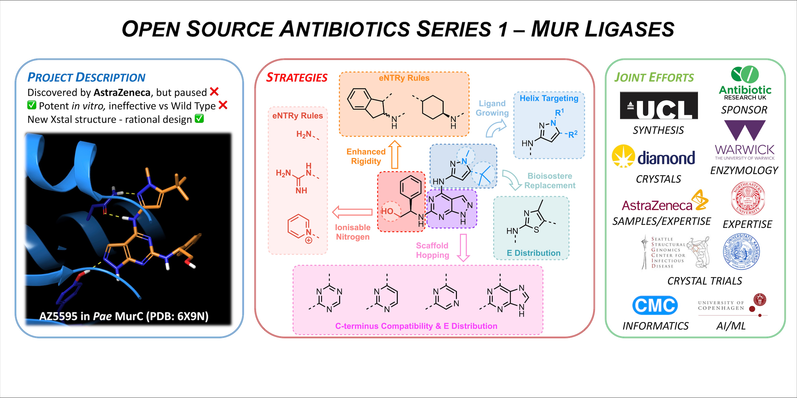
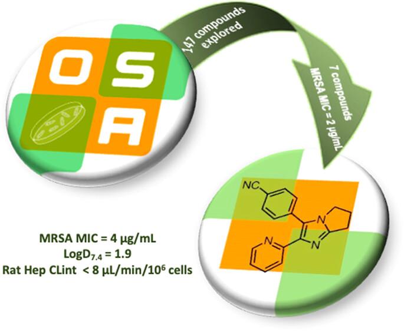
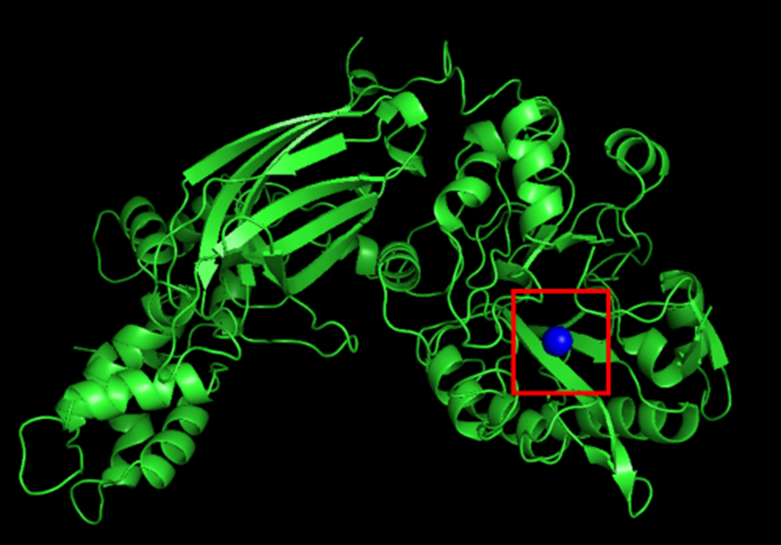

We are most known for the [Open Source Malaria](http://opensourcemalaria.org/#) project, our [open science](http://www.nature.com/nchem/journal/v3/n10/full/nchem.1149.html) work more generally and for the use of [click-derived triazoles in chemical sensing](http://dx.doi.org/10.1039/C0CS00143K). However, there are plenty of other projects that interest us.

Click a research area to jump to the relevant section below:

- <a href="#open_science">Open Science</a>

- <a href="#synthetic_methodology">Synthetic Methodology</a>

- <a href="#asymmetric_catalysis">Asymmetric Catalysis</a>

- <a href="#chemical_education">Chemical Education</a>

- <a href="#automated_synthesis_planning">Automated Synthesis Planning</a>

# Open Science

We live in the age of the internet, one of the most transformative inventions of our time. Computer scientists understood what the internet meant - working together without barriers. Scientists are just catching up. We could collaborate in more productive ways if only we were less wedded to secrecy.

We have adopted open source principles to experimental lab science. The first project successfully used this idea to find a way of producing the important drug praziquantel (used to treat the dreadful disease [Schistosomiasis](http://en.wikipedia.org/wiki/Schistosomiasis)) as a single enantiomer. All data and ideas were freely shared and anybody could take part. People did - about 30, and the problem was more quickly solved than we could have alone because strangers came along and contributed where they were able to. The science was published [here](http://www.plosntds.org/article/info%3Adoi%2F10.1371%2Fjournal.pntd.0001260) (check out the awesome links to actual lab notebook pages) and the way we did it was published separately in [Nature Chemistry](http://www.nature.com/nchem/journal/v3/n10/full/nchem.1149.html). The website where it all got started was [The Synaptic Leap](http://www.thesynapticleap.org/node/286) and all the work was described in [an online electronic lab notebook (ELN)](http://www.ourexperiment.org/racemic_pzq).

This made us think, what about drug discovery? Could we discover new drugs using an open approach and without patents? So, we started a project to see if this works and we're now driving the Open Source Malaria project, a fully open, borderless, patentless drug discovery project for malaria that aims to discover a compound that will enter Phase I clinical trials. It's a fantastically exciting project made possible by the continual contributions of a scientists around the world.

We've also founded several other consortia, below. All of these generally follow the [Six Laws](https://chemistry-europe.onlinelibrary.wiley.com/doi/full/10.1002/cmdc.201900565) in how they operate - these laws (which are guidelines, really,for those of you who don't like laws) were derived _post facto_, i.e. from what worked best and was simplest for everyone to understand.

We need a good place to capture all the discussion that the idea of open source drug discovery has created (it's a lot) but some examples will be collated here, like [this](https://itsfoss.com/open-source-impact-on-science/) and [this](https://rbharath.github.io/why-should-drug-discovery-be-open-source/).

### Licences

There is no adequate licence to cover entire open source drug discovery projects. Open Source Malaria and others use the CC-BY licence. [Data should abide by the FAIR principles](https://www.nature.com/articles/d41586-019-01720-7). [Linking those who generate data with the downstream use of that data](https://www.nature.com/articles/d41586-019-01715-4) (for credit) might be desirable.

### Non-profit Pharmaceutical Synthesis

[General article](https://nonprofitquarterly.org/the-new-nonprofit-pharmaceutical-world-whats-up-with-that/). [CivicaRx](https://civicarx.org/media/).

### Projects:

<h2>Open Source Antivirus</h2>
  

  READDI-AViDD Pipeline is up to date [here](https://docs.google.com/spreadsheets/d/1V8cX5bVjVRNazExtO6E8YCDZtm8nlSFoL-nHTYfqbeE/edit#gid=0).

  The Structural Genomics Consortium (SGC) is collaborating with the Rapidly Emerging Antiviral Drug Development Initiative (READDI) to identify orally-available small molecular drugs that can treat and prevent viral infections. The collaboration is funded by the National Institute of Health (NIH) through the [READDI-AViDD project](https://readdi.org/stories/readdi-receives-65m-grant-from-nih-to-establish-an-antiviral-drug-discovery-avidd-center/), specifically focused on viruses with potential for large global negative impact.

  The collaboration is driven by identification and isolation of viral target proteins and establishing assays to conduct high-throughput screening of various commercial and non-commercial libraries. The aim is to identify hits that can act as starting points for further medicinal chemistry development, that can eventually lead to new drugs we can use to combat viral infections that have potential to spread widely globally. All generated data is available online and updated regularly.

  

<h2>Open Source Antibiotics</h2>
  

### Open Source Antibiotics <a href="https://twitter.com/OSantibiotics"><i class="fa fa-twitter"></i></a>

We founded the [Open Source Antibiotics](https://github.com/opensourceantibiotics/GeneralTopics) (OSA) consortium to apply our open source way of working to the discovery of new, inexpensive medicines for bacterial infections. There are currently two series in the OSA consortium.

**[OSA Series 1](https://github.com/opensourceantibiotics/murligase)** - _Mur ligases_

The focus is the discovery and development of new antibiotics, specifically inhibitors of the Mur ligase enzymes using a fragment based approach.

OSA Series 1 project focused on structural modifications of a potent MurC inhibitor AZ5595, [developed by AstraZeneca through a lead modification campaign](https://pubs.acs.org/doi/10.1021/cb500360c). Despite having single digit nanomolar activities against Eco and Pae MurC, it suffered from permeability issues and bacterial efflux mechanisms, and thereby failed to translate such potency to antibacterial activity against wild-types.

Initially, we brought in the eNRTy rules from [Hergenrother’s](https://www.nature.com/articles/nature22308) [team](https://pubs.acs.org/doi/full/10.1021/acsinfecdis.0c00715): replacing the alcohol group in AZ5595 (and other potent derivatives) with amine, guanidinium or pyridinium groups as well as introducing strengthened rigidity (less rotational bonds) in pursuit of a better accumulation in bacteria.

Considering Mur ligases share a highly conserved active site across enzyme types and bacterial species, further multi-targeting modifications (bioisostere replacement, ligand growing, and scaffold hopping) were implemented in hope of obtaining better binding interactions (especially targeting the active site helix which originally binds the ADP phosphate group) and improved binding pocket compatibility (reduce the potential steric clashes with Mur ligase C-terminus). [Learn more here](https://onlinelibrary.wiley.com/doi/full/10.1111/mmi.12758).

**[OSA Series 2](https://github.com/opensourceantibiotics/Series-2-Diarylimidazoles)** - _Diarylimidazoles_

This project involved the optimisation of a series of molecules discovered at the University of North Carolina Chapel Hill and has been [published](https://pubs.acs.org/doi/10.1021/acsinfecdis.3c00286). The molecules are easy to make and show promise against MRSA. We worked completely openly (for example, recording our [research meetings](https://www.youtube.com/playlist?list=PL0eLxnHhou_k1Upbn5X1mdHBwKMYkRpLH). The core funding, arising from a grant from Pharmalliance, successfully elicited contributions from talented external groups, including the private sector - Hypha drug discovery. Sharing of molecules with other groups ensured we could extract additional value from them in [other projects](https://pubs.acs.org/doi/10.1021/acsinfecdis.3c00040).

If you have a series you'd like to explore in this way - perhaps something you've paused, or something you'd like to get off the ground - get in touch.

  

<h2>Open Source Malaria</h2>
  

### Open Source Malaria <a href="https://twitter.com/o_s_m"><i class="fa fa-twitter"></i></a>

Malaria is a debilitating disease with more than 230 million infections and half a million deaths a year, mostly children. The continual development of resistance by the relevant Plasmodium parasite means that it is crucial to develop medicines with novel mechanisms of action if we are to combat the disease effectively, to complement the use of other measured like bed nets and vaccines. 

Mat founded the **Open Source Malaria (OSM) Consortium** in 2011 with the Medicines for Malaria Venture ([Github](https://github.com/OpenSourceMalaria), [Landing Page](http://opensourcemalaria.org/#)). OSM carries out open source drug discovery: hit to lead and lead optimisation projects using public domain starting points. The first three series, below, derived from molecules discovered by GSK Tres Cantos, and the fourth series derives from a series discovered by Pfizer. Series 1 was [published](https://pubs.acs.org/doi/10.1021/acscentsci.6b00086). Series 2 was paused when it was realised that we were working on these molecles at the same time as a closed group, and we wanted to avoid duplication of effort.

The starting point of [Series 3](https://github.com/OpenSourceMalaria/Series3), OSM-S-106, a thienopyrimidine-based sulfonamide, showed promise due to its potency, solubility, low toxicity, and low molecular weight. Originally we were unable to improve it and paused the project. However, our recent [studies](https://www.nature.com/articles/s41467-024-45224-z) carried out by PhD student Yinuo Wang have demonstrated that OSM-S-106 targets _Plasmodium falciparum_ asparagine tRNA synthetase (PfAsnRS) through a very cool “reaction hijacking” mechanism in which the molecule reacts with the tRNA-amino acid adduct to create a new asparagine adduct of OSM-S-106. We are now optimising  OSM-S-106 to see if we can improve its potency a little such that it can enter preclinical evaluation. 

Based on these results, we've become curious about the activity of other amino acid derivatives of OSM-S-106. It's likely that Yinuo's PhD will focus on synthesizing a complete set of such adducts to share with the community. The most recent proline adduct (MMV2240865) has shown promising results, with an activity of 3 nM against the 3D7 strain. 

_Notes needed here about Series 4_. In 2019-2020, with funding from EPSRC/AI3SD, OSM ran a predictive modelling competition to figure out whether new methods in artificial intelligence and machine learning could help predict new active molecules in a phenotypic drug discovery project (where we had no detailed structure of the biological target). Here is the [report of the Jan 2020 meeting](https://eprints.soton.ac.uk/438123/) we ran, the [relevant Github repository](https://github.com/OpenSourceMalaria/Series4_PredictiveModel) and the [preprint](https://chemrxiv.org/articles/preprint/An_Open_Drug_Discovery_Competition_Experimental_Validation_of_Predictive_Models_in_a_Series_of_Novel_Antimalarials/13194755).

Old: (A brief note on the Pied Piper role. Open source projects benefit from a coordinator, to guide, assimilate, reach out. This is often referred to as a [Pied Piper](https://en.wikipedia.org/wiki/Pied_Piper_of_Hamelin) role, but a _much_ better analogy is the [James Murray](https://en.wikipedia.org/wiki/James_Murray_(lexicographer)) role.)

[YouTube channel](http://www.youtube.com/user/OSDDMalaria) all now old.

  

<h2>Open Source Mycetoma</h2>
  

### Open Source Mycetoma <a href="https://twitter.com/MycetOS"><i class="fa fa-twitter"></i></a>

  

<h2>Open Source Pharma</h2>
  

### Open Source Pharma <a href="https://twitter.com/opensrcpharma"><i class="fa fa-twitter"></i></a>

We've co-founded a broader open source pharma movement which has been defined by participants from across the public and private sectors, with early backing from Open Society Foundations, The Rockefeller Foundation and Tata Trusts. The idea is to promote more open forms of collaboration towards "Medicines for All". The underlying ideas were discussed at WHO in 2013 ([Is Open Source Drug Discovery Practical?](https://www.youtube.com/playlist?list=PLyNnVQbuVDGUoKnHcazuExFE5aCaTtn8V), [WHO News Item](https://www.who.int/tdr/news/2013/odd/en/)), and guiding principles were established at a [meeting](https://www.opensourcepharma.net/bellagio.html) in 2014 ([WHO News Item](https://www.who.int/tdr/news/2014/open-source-pharma-mtg/en/)) with further [conferences](https://www.opensourcepharma.net/conferences.html) in 2015 and 2019. The overall approach is described in a short [2017 "Roadmap" paper](https://journals.plos.org/plosmedicine/article?id=10.1371/journal.pmed.1002276) (with more details provided in the longer [supporting information](https://journals.plos.org/plosmedicine/article?id=10.1371/journal.pmed.1002276#sec006) document).

(Associated Articles/Media: [2014 Canadian Radio interview "Can open-source pharma cure Ebola and other neglected killers?"](https://www.cbc.ca/player/play/2523952984).

There are many and repeated calls for different ways to discover and develop medicines, in particular for better panedemic preparedness (e.g. [here](https://blogs.bmj.com/bmj/2021/04/01/preparing-for-the-next-pandemic-requires-public-health-focused-industrial-policy/))

There are many other possible means of funding open models of drug discovery. One is [blockchain](https://medium.com/molecule-blog/an-open-bazaar-for-drug-development-molecule-protocol-a47978dd914). Another, that we're involved in, is the use of existing market instruments like regulatory data exclusivity - see our company [M4ID](https://www.m4idpharma.com/). One wonders whether some of [the methods for funding open source software](https://github.com/nayafia/lemonade-stand/blob/master/README.md) might be translatable to drug discovery.

  

<h2>Open Source Tuberculosis</h2>
  

### Open Source Tuberculosis <a href="https://twitter.com/opensourcetb"><i class="fa fa-twitter"></i></a>

Mat founded the [Open Source Tuberculosis (OSTB) Consortium ](https://github.com/OpenSourceTB/OSTB_General_Start_Here) and there are currently three compound series.

**[OSTB Series 1](https://github.com/OpenSourceTB/OSTB_Series_1/wiki/What-is-OSTB-Series-1%3F)** - _The spiro series_

Many of the compounds in this series displayed high potency vs _M.tb_ but a significant risk of hERG inhibition and a lower-than-desired _in vivo_ tolerability combined lead us to park the series. The series was publish in [J. Med. Chem.](https://pubs.acs.org/doi/10.1021/acs.jmedchem.8b01533) in 2018 and all the [data](https://github.com/OpenSourceTB/OSTB_Series_1/wiki/Sources-of-Data) is available for anyone to pursue.

**[OSTB Series 2](https://openwetware.org/wiki/OpenSourceTB:OSTB_Series_2)** - _Imidazopyridines_

**OSTBS27** was identified by GSK in a high throughput screen. **OSTBS27** is active against both replicating _M.tb_ (MIC vs. H37Rv = 10 μM) and non-replicating TB (>50% inhibition in 10 experiments out of 13) with mean PXC50 of 5.2 μM. The project is currently available for anyone to pursue.

**[OSTB Series 3](https://github.com/OpenSourceTB/OSTB_Series_3/wiki)** - _Small molecule inhibitors of non-replicating M.tb_

**OSTBS83** was identified by GSK and Cornell University in [2015](https://pubs.acs.org/doi/10.1021/acsinfecdis.5b00025)
as a selective inhibitor of non-replicating _M.tb_ (NR IC90 = 2.01 μM). This project is [active](https://github.com/OpenSourceTB/OSTB_Series_3) and to date [> 60 compounds](https://docs.google.com/spreadsheets/d/1z2cjYPx4elBNuZOQjKd0Gn4aTQMz_W58dztc1uYSpZg/edit#gid=0) have been evaluated for activity against non-replicating M.tb, in a pursuit to develop a new drug for [latent tuberculosis](https://www.who.int/tb/areas-of-work/preventive-care/ltbi_faqs/en/).

_Contributions to this project are welcomed._

  

<h2>Non-hormonal Contraceptives</h2>
  

The Structural Genomics Consortium (SGC) has been funded by the Bill & Melinda Gates Foundation to generate protein reagents and chemical probes for several potential drug targets for new, safe and effective non-hormonal contraceptives. Contraceptives allow informed choices about family planning. Research into non-hormonal contraceptives is important due to concerns over the safety and side effects of current hormonal methods.
 
Two promising protein targets we are working on are phospholipase C zeta 1 (PLCζ1) and α/β hydrolase domain 2 (ABHD2). For both targets, we have successfully expressed and purified functional protein and developed a biochemical screening assay to identify inhibitors of activity.
 
For PLCζ1, we are planning several screens including a DEL (DNA-encoded library) screen and ASMS (affinity selection mass spectrometry) screen, from which we hope to identify chemical probes.
 
We have developed small molecule inhibitors of ABHD2 and are using these to investigate the mechanism of this protein.

The wikis are [here](https://github.com/StructuralGenomicsConsortium/CNP5-PLCZ1/wiki) for PLCz1 and [here](https://github.com/StructuralGenomicsConsortium/CNP6-ABHD2/wiki) for ABHD2.

  

# Synthetic Methodology

The group's motto is _To make the right molecule in the right place at the right time_. While nobody understands what this means it is crucial that we know how to make molecules. The group is mainly interested in developing methods for the construction of new bonds in small molecules, i.e. the development of ways of making bonds that cannot currently be made.

New project in Late Stage Functionalisation. Relevant to this: [Late stage azidation](http://pubs.acs.org/doi/full/10.1021/acscentsci.6b00214), [catalyst-controlled site-selective bond activation](http://pubs.acs.org/doi/abs/10.1021/acs.accounts.6b00546).

# Asymmetric Catalysis

One of the most value but difficult things an organic chemist can do is to selectively synthesise one enantiomer of a molecule, and most impressively via catalysis. We are interested in asymmetric catalysis and the rational development of new catalysts for asymmetric reactions. Recently we ran an [Open Source Catalysis Project](http://115.146.85.21/) and this is awaiting the right student to reboot it.

Catalyst prediction: [2017 review](http://pubs.acs.org/doi/abs/10.1021/acs.accounts.6b00555), [Use of noncovalent interactions](http://pubs.acs.org/doi/abs/10.1021/acs.accounts.6b00613), [Computational catalyst design](http://pubs.acs.org/doi/abs/10.1021/acs.accounts.6b00606)

Autocatalysis: [speculations on ways of symmetry-breaking in synthesis](http://onlinelibrary.wiley.com/doi/10.1002/chem.201404534/abstract)

# Chemical Education

We made up a very cool Treasure Hunt for chemical education that you can read about here. Essentially the answers to questions guide you round a campus so that you find certain objects, and when you have found all the objects you draw them out on a campus map and the shape gives you the structure of a molecule, which is the "treasure". This could work for lots of other disciplines too and it'd be possible to use Google Maps to make a global version, though we've not yet tried.

We also like chemical animations. We like getting students involved with making real molecules in large numbers - we have done this through the Open Source Malaria project with some success.

In response to the price hike of HIV/AIDS drug, pyrimethamine (Daraprim), by Turing Pharmaceuticals, we helped a small team of high school students from Sydney Grammar School to synthesise the drug. The team produced 3.7 grams of Daraprim for $US20, which would be worth between $US35,000 and $US110,000 in the United States based on hiked prices. This received significant media attention and was featured on ABC, BBC, CNN, The Guardian, and Time.

[ALTC teaching project blog](http://altc.ourexperiment.org/blog_project)

# Automated Synthesis Planning

This is an area we'd love to do more of, ever since [Mat's original review of the field](https://pubs.rsc.org/en/content/articlelanding/2005/CS/b104620a) way back when.

[Alphachem](https://arxiv.org/abs/1702.00020). [Prediction of reaction outcomes](http://pubs.acs.org/doi/full/10.1021/acscentsci.7b00064), [Neural networks for reaction prediction](http://pubs.acs.org/doi/pdf/10.1021/acscentsci.6b00219)

Machine Learning and AI: [AI assistants in chemistry](http://pubs.acs.org/doi/abs/10.1021/acs.accounts.7b00009), [Reaction prediction based on knowledge graph of chemistry](http://onlinelibrary.wiley.com/doi/10.1002/chem.201604556/full)

[Chematica](https://www.sciencedirect.com/science/article/pii/S2451929418300639). [Tim Cernak's very cool combination of software and molecular graph editing](https://www.science.org/doi/10.1126/science.ade8459).

Impact of AI in Drug Discovery: [Neural networks for generation of libraries](http://pubs.acs.org/doi/abs/10.1021/acs.accounts.6b00613)
